# Практика 10 — Авторизация: куки и сессии

## Часть A. Подготовка и вёрстка

### Задание 1. Столбец password_hash

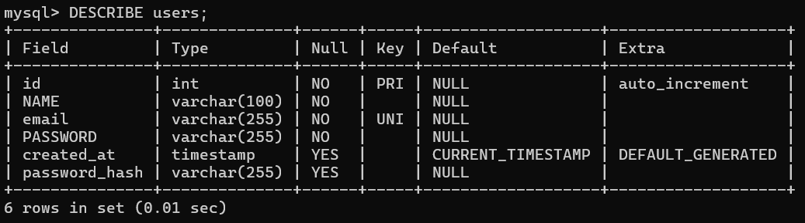

**Почему VARCHAR(255), а не VARCHAR(60)? Что бы произошло если сделать VARCHAR(50)?**

Хэш пароля (bcrypt) может занимать до 255 символов.
VARCHAR(60) обычно хватает для bcrypt, но использование VARCHAR(255) даёт запас на будущее (например, другой алгоритм).

Если сделать VARCHAR(50), хэш будет обрезаться → пароль невозможно будет проверить -> логин сломается.

---

### Задание 2. Partials

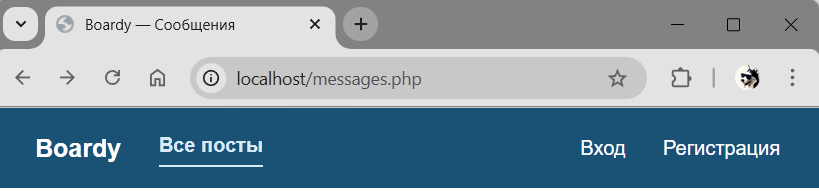

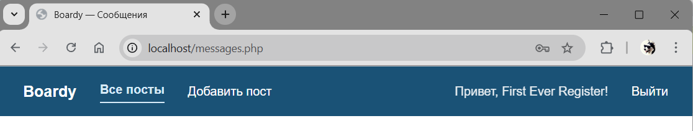

**Почему меню вынесено в отдельный файл? Что изменится если добавить новую ссылку?**

Меню вынесено в отдельный файл для переиспользования (DRY).
Оно подключается на всех страницах через include.

Если добавить новую ссылку (например, «Избранное»), достаточно изменить только nav.php — изменения применятся ко всем страницам.

---

### Задание 3. Вёрстка форм

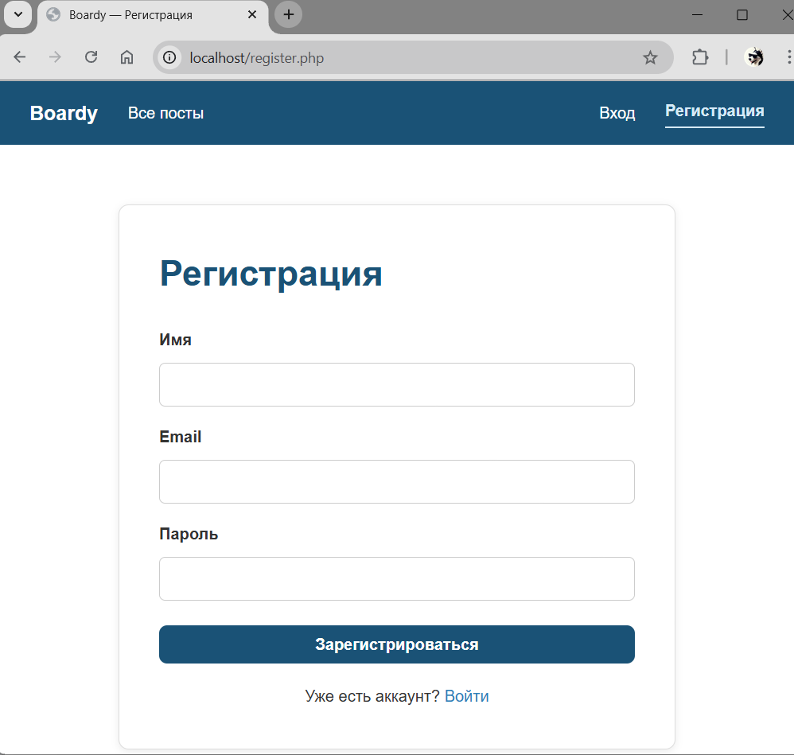

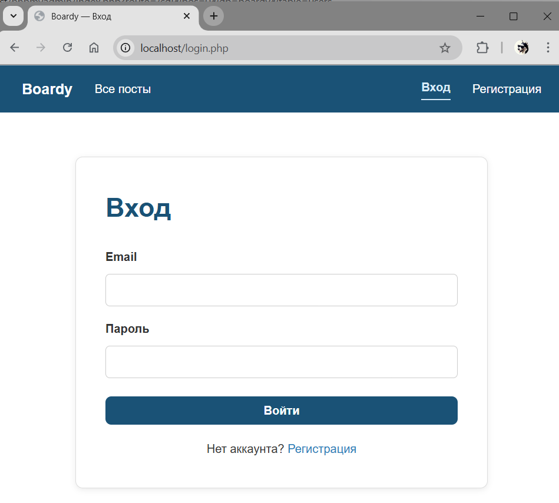

---

## Часть B. Регистрация и логин

### Задание 4. Регистрация

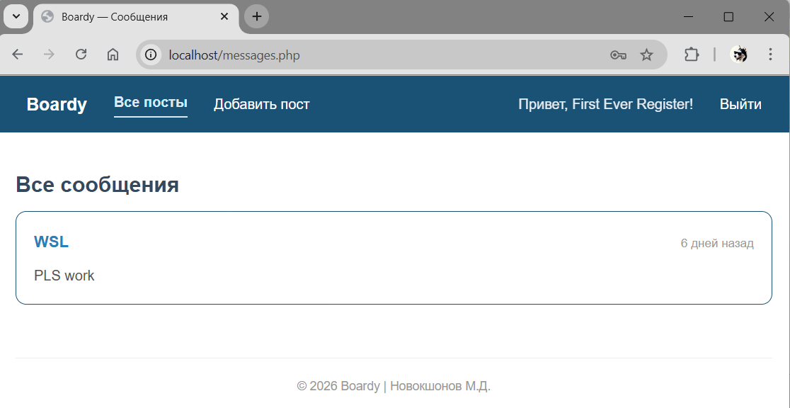

---

### Задание 5. Хеш в базе

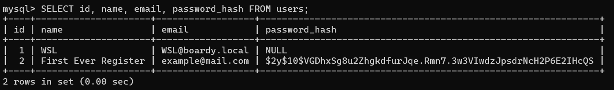

**Объясните структуру хеша $2y$10$... Что произойдёт если cost увеличить с 10 до 15?**

Структура:

* `$2y$` — алгоритм bcrypt
* `10` — cost factor (сложность)
* остальное — соль + хэш

Если увеличить cost с 10 до 15:

* хэширование станет значительно медленнее
* повысится безопасность (сложнее перебор)
* увеличится нагрузка на сервер

---

### Задание 6. Повторная регистрация

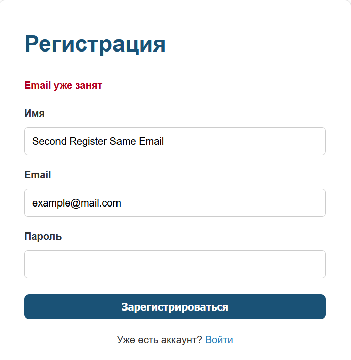

**Зачем проверять email перед INSERT? Что будет без проверки?**

Проверка нужна для:

* предотвращения дублирования пользователей
* корректного вывода ошибки

Без проверки:

* произойдёт ошибка БД (из-за UNIQUE)
* пользователь увидит неинформативную ошибку

---

### Задание 7. Логин

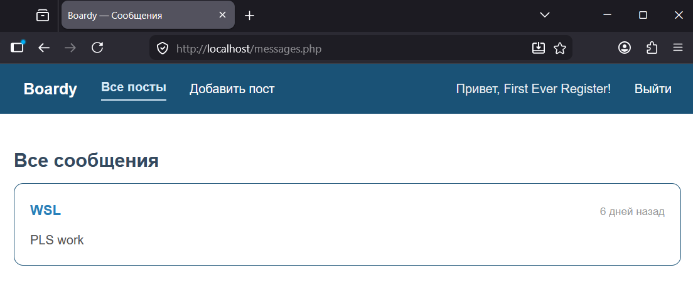

---

### Задание 8. Неверный пароль

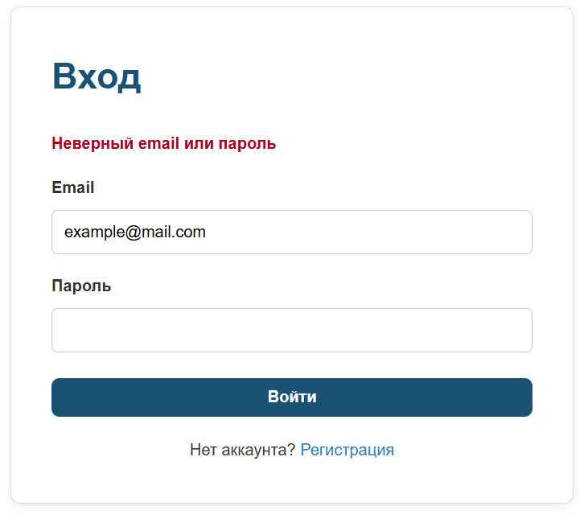

**Почему сообщение одинаковое для email и пароля?**

Чтобы не раскрывать, существует ли пользователь.
Иначе злоумышленник сможет перебирать email (user enumeration).

---

## Часть C. Куки и сессии

### Задание 9. PHPSESSID

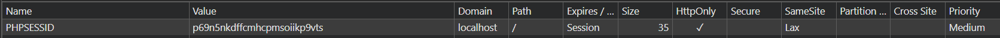

**Что хранится в значении куки?**

В куке хранится только ID сессии (случайная строка).
Это не пароль и не данные пользователя.

Значение генерируется PHP при создании сессии.

---

### Задание 10. Параметры куки


**Что будет если убрать HttpOnly?**

JavaScript сможет читать cookie -> возможна кража сессии через XSS.

---

### Задание 11. HttpOnly

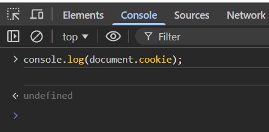

**Почему PHPSESSID не видна в document.cookie?**

Потому что установлен флаг HttpOnly, который запрещает доступ к cookie из JavaScript.

---

### Задание 12. Файл сессии


**Что хранится в файле? Почему разделено?**

В файле хранится:

* user_id
* user_name

Сравнение:

* клиент (cookie) -> только ID
* сервер -> реальные данные

Такое разделение безопаснее — данные пользователя не уходят в браузер.

---

## Часть D. Защита и доработка

### Задание 13. Защита страниц

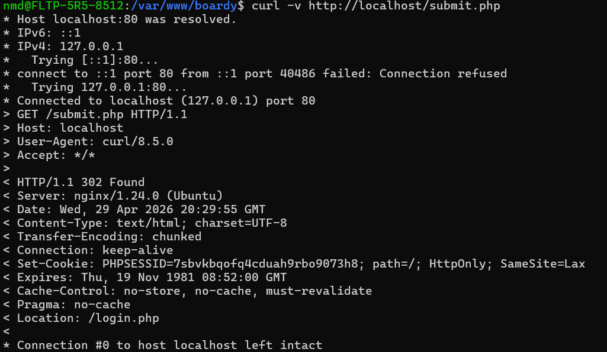

---

### Задание 14. Посты с автором

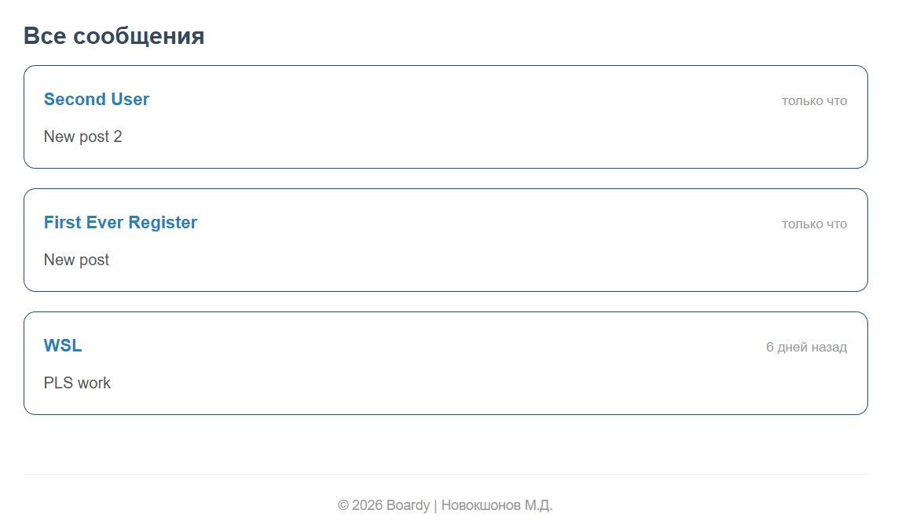

**SQL с JOIN**

```sql
SELECT posts.body, users.name, posts.created_at
FROM posts
JOIN users ON posts.author_id = users.id
ORDER BY posts.created_at DESC;
```

**Почему JOIN, а не два запроса?**

JOIN быстрее и удобнее:

* один запрос вместо двух
* нет лишних обращений к БД
* данные сразу связаны

---

### Задание 15. Добавление поста

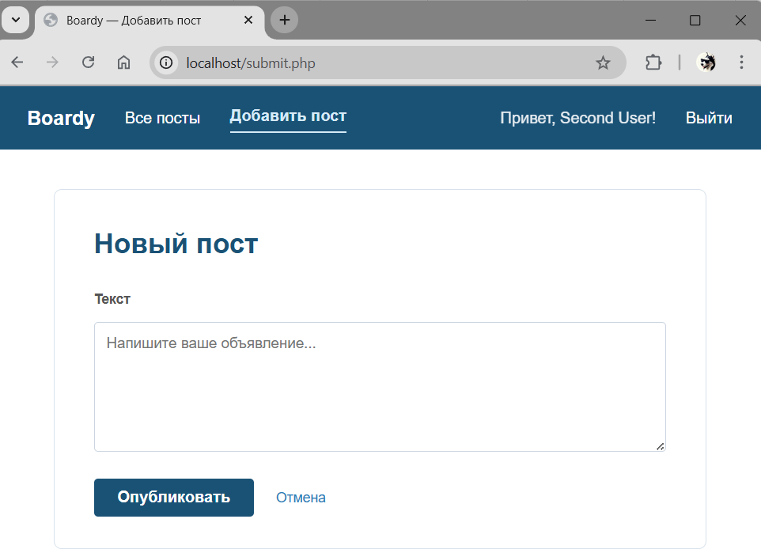

---

### Задание 16. Logout

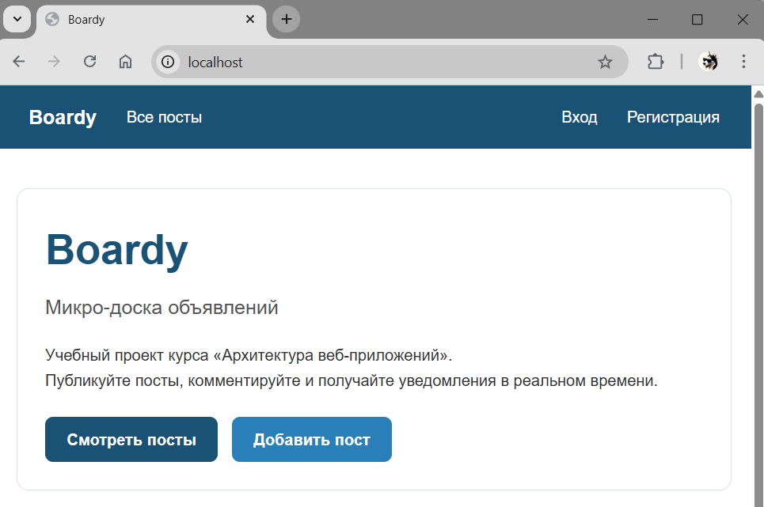

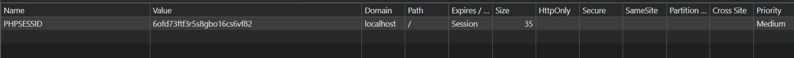

**Что делает session_destroy()? Зачем setcookie()?**

* session_destroy() удаляет сессию на сервере
* setcookie() удаляет cookie в браузере

Если сделать только session_destroy():
-> cookie останется

Если только setcookie():
-> файл сессии останется на сервере

---

### Задание 17. Истёкшая сессия

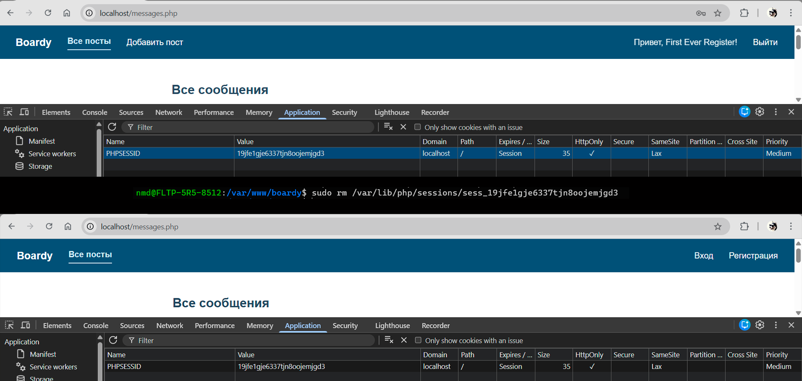

**Почему браузер "залогинен", а сервер — нет?**

Браузер хранит cookie (ID сессии),
но сервер не находит файл сессии -> считает пользователя неавторизованным.
