# Практика 11 — JWT для API и OAuth через GitHub

## Часть A. JWT для API

### Задание 1. auth.py

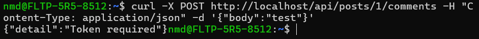

**Что означает «Bearer» в заголовке Authorization? Почему не просто «Authorization: eyJ...»?**

Bearer означает, что токен является «токеном доступа» (bearer token) — любой, кто его имеет, получает доступ.

Формат `Authorization: Bearer <token>` — стандарт HTTP. Он позволяет серверу понять тип авторизации.

Если отправить просто `Authorization: eyJ...`, сервер не поймёт тип токена и не сможет корректно его обработать.

---

### Задание 2. /api/me.php

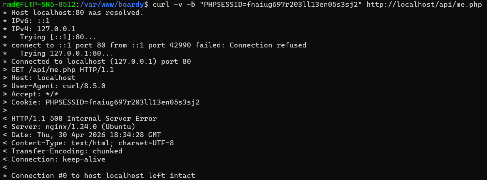

**Почему me.php использует session_start(), а не принимает логин/пароль? Какую роль играет кука PHPSESSID?**

me.php использует session_start(), потому что пользователь уже аутентифицирован ранее (через форму логина или OAuth).

Кука PHPSESSID содержит ID сессии, по которому сервер находит данные пользователя.

То есть:

* браузер отправляет PHPSESSID
* сервер находит $_SESSION
* из неё берётся user_id
* на основе этого создаётся JWT

---

### Задание 3. React получает JWT

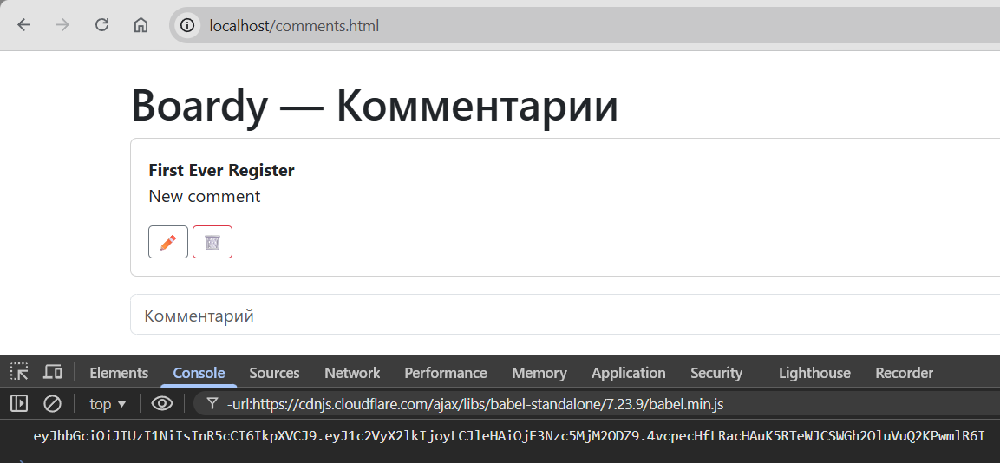

---

### Задание 4. Bearer в запросах

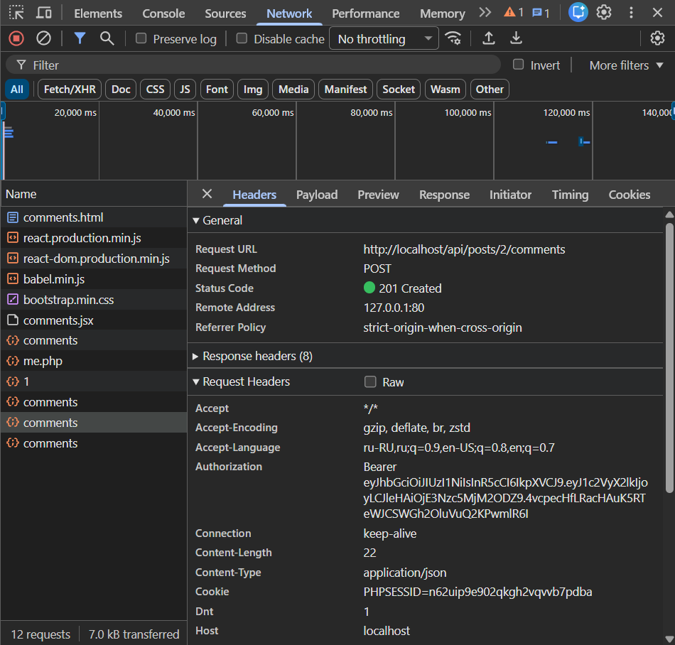

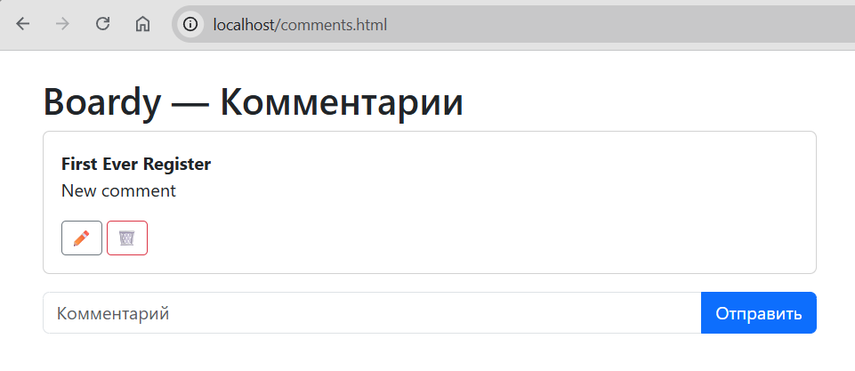

---

### Задание 5. jwt.io

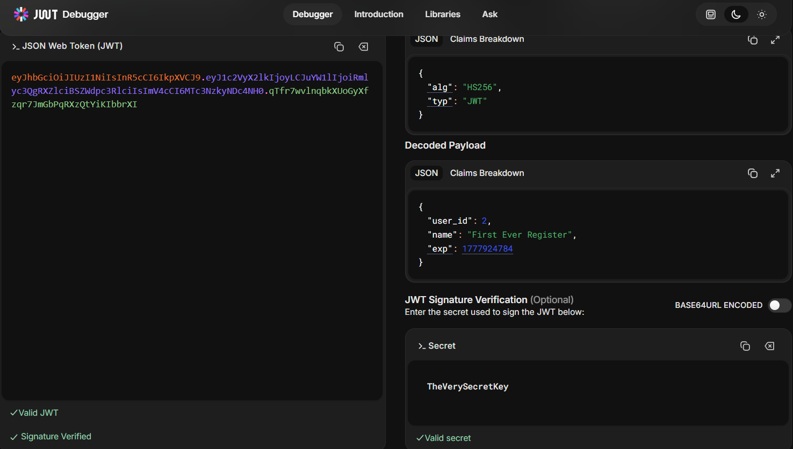

**Payload зашифрован или закодирован? Что увидит злоумышленник? Почему это не проблема?**

Payload не зашифрован, а закодирован (Base64).

Злоумышленник сможет увидеть:

* user_id
* name
* exp

Это не проблема, потому что:

* данные не являются секретными
* важна подпись (signature)
* без знания SECRET_KEY нельзя подделать токен

---

### Задание 6. Истёкший токен

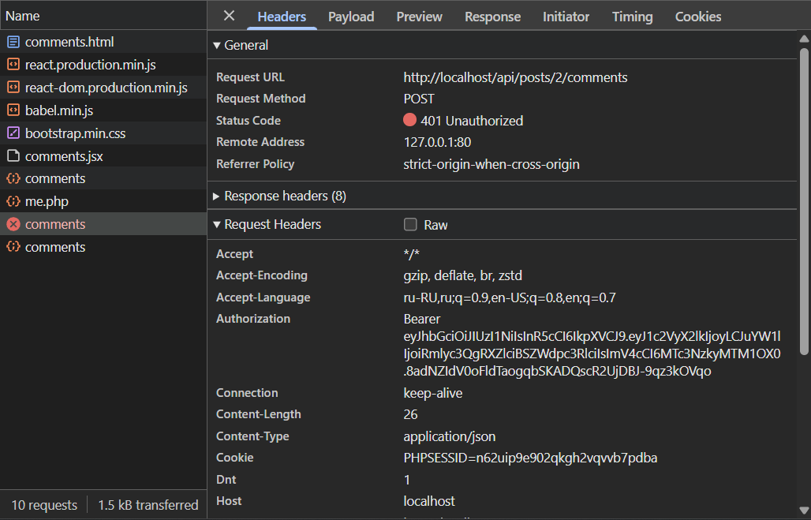

---

### Задание 7. Невалидный токен

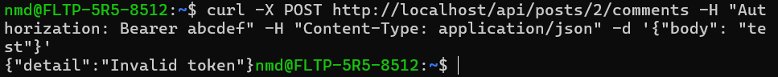

---

## Часть B. OAuth через GitHub

### Задание 8. OAuth App

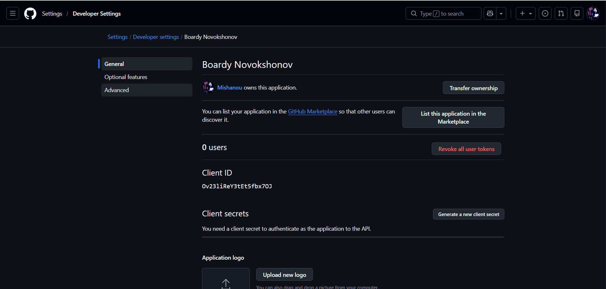

---

### Задание 9. Столбец github_id

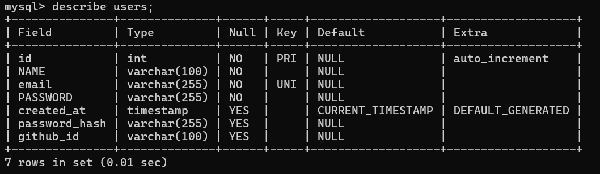

---

### Задание 10. Кнопка GitHub

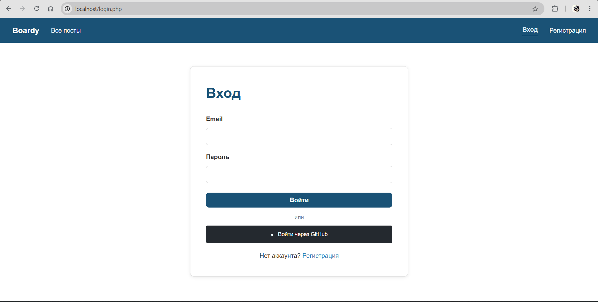

---

### Задание 11. OAuth flow

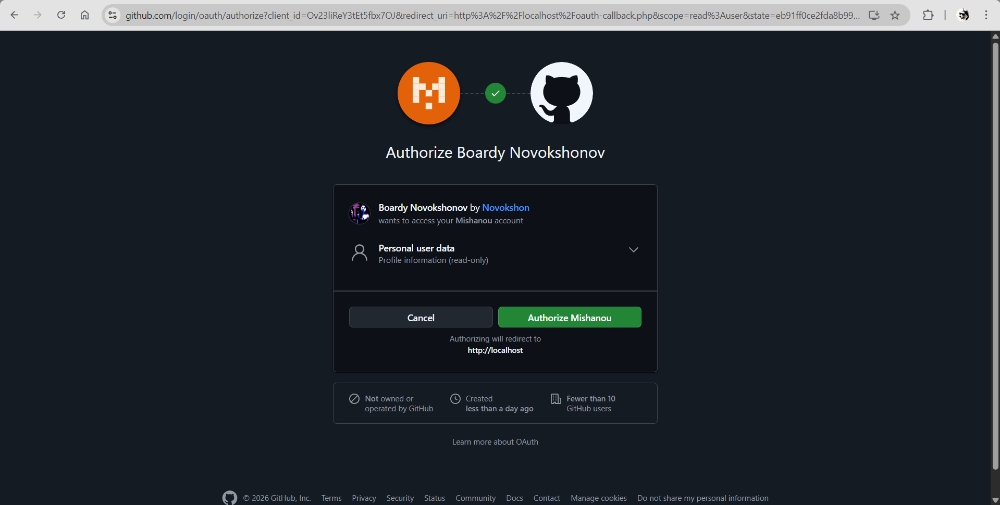

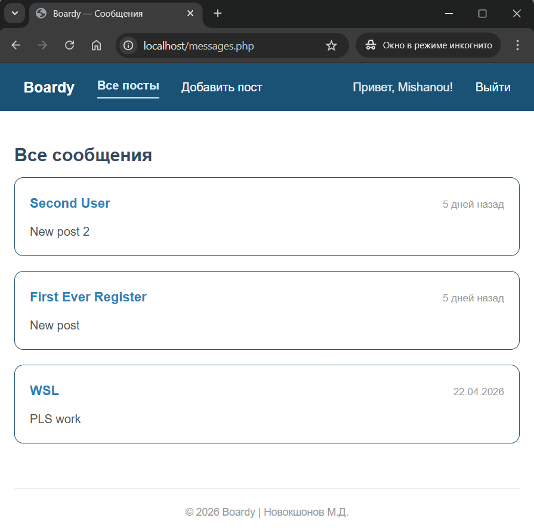

---

### Задание 12. github_id в базе

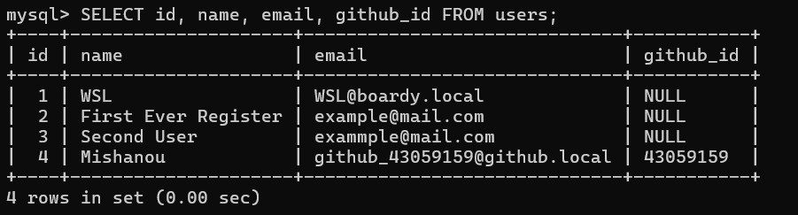

**Почему ищем по github_id, а не по email?**

Email может:

* отсутствовать (GitHub не всегда отдаёт email)
* изменяться пользователем

github_id:

* уникальный
* неизменяемый
* гарантированно приходит от GitHub

Поэтому он надёжнее для идентификации.

---

### Задание 13. OAuth → JWT → API

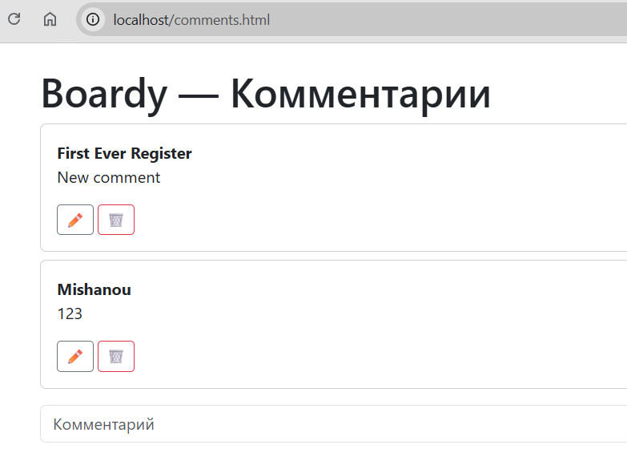

**Flow:**

1. Пользователь нажимает «Войти через GitHub»
2. Переход на GitHub OAuth
3. Пользователь подтверждает доступ
4. GitHub редиректит на oauth-callback.php с code
5. Сервер получает access_token
6. Получает данные пользователя
7. Создаёт/находит пользователя в БД
8. Создаёт PHP-сессию ($_SESSION)
9. React вызывает /api/me.php
10. PHP создаёт JWT
11. React сохраняет JWT
12. JWT отправляется в FastAPI
13. FastAPI проверяет токен
14. Создаётся комментарий с author_id из JWT

---

### Задание 14. Параметр state

**Что такое state в OAuth?**

state — это случайная строка, которая отправляется на GitHub и возвращается обратно.

Она используется для защиты от CSRF.

---

**Сценарий атаки без state:**

1. Злоумышленник инициирует OAuth flow со своим аккаунтом
2. Получает code
3. Формирует ссылку с этим code
4. Жертва открывает ссылку
5. Сервер принимает code и логинит жертву как злоумышленника

В итоге:

* пользователь думает, что он вошёл
* но работает от имени злоумышленника

state предотвращает это, проверяя, что запрос был инициирован именно этим пользователем.

---

## Часть C. Анализ

### Задание 15. Три способа входа

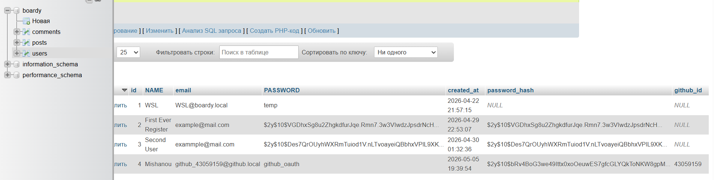

---

### Задание 16. Сравнение

| Вопрос                  | Куки+сессии      | JWT               | OAuth                 |
| ----------------------- | ---------------- | ----------------- | --------------------- |
| Где хранятся данные?    | Сервер (файл)    | В токене (клиент) | У провайдера + сервер |
| Кто прикрепляет?        | Браузер (cookie) | Клиент (header)   | Браузер + сервер      |
| Для каких клиентов?     | Web              | API, SPA, mobile  | Web, mobile           |
| Можно ли отозвать?      | Да               | Нет (до exp)      | Да                    |
| Кросс-доменно работает? | Нет              | Да                | Да                    |

---

### Задание 17. Баги и пакеты

**1. Самописный JWT**

Проблема:

* возможны ошибки в подписи
* нет проверки алгоритмов

Опасность:

* подделка токенов

Решение:

* библиотеки (например, firebase/php-jwt)

---

**2. OAuth без готовых библиотек**

Проблема:

* ручная работа с HTTP
* легко ошибиться

Опасность:

* утечка токенов
* неправильная валидация

Решение:

* Laravel Socialite

---

**3. Работа с сессиями**

Проблема:

* ручная настройка cookie
* нет защиты от фиксации сессии

Опасность:

* угон сессии

Решение:

* встроенные механизмы Laravel (Auth, Session)