# Часть A. Установка и переключение домена

## Задание 1. Composer и PHP-расширения

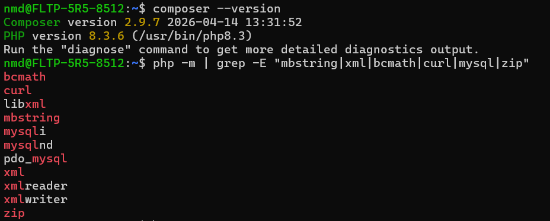

## Задание 2. Переезд папок

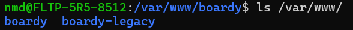

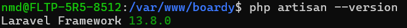

## Задание 3. Структура Laravel

Назначение основных папок Laravel:

`app/` — основной PHP-код приложения: модели, контроллеры, политики и сервисная логика.

`routes/` — описание маршрутов приложения, то есть связь URL с контроллерами и обработчиками.

`resources/views/` — Blade-шаблоны, из которых Laravel собирает HTML-страницы.

`database/` — миграции, фабрики и сидеры для структуры и тестового наполнения базы данных.

`public/` — публичная директория сайта, единственная папка, доступная напрямую через Nginx. В ней лежит `index.php`, CSS, JS и другие публичные файлы.

**Почему document_root nginx должен указывать на public/, а не на /var/www/boardy/? Что плохого случится, если указать на корень?**

`public/` — это граница между внешним миром и внутренним кодом Laravel. Только там должен быть доступный из браузера входной файл `index.php` и публичные ассеты. Если указать `root /var/www/boardy`, то браузеру могут стать доступны внутренние файлы проекта: `.env`, `composer.json`, код из `app/`, миграции, кеши и другие служебные файлы. Самое опасное — `.env`, потому что в нём лежат пароли к базе данных, ключ приложения и OAuth-секреты.

## Задание 4. Nginx-конфиг

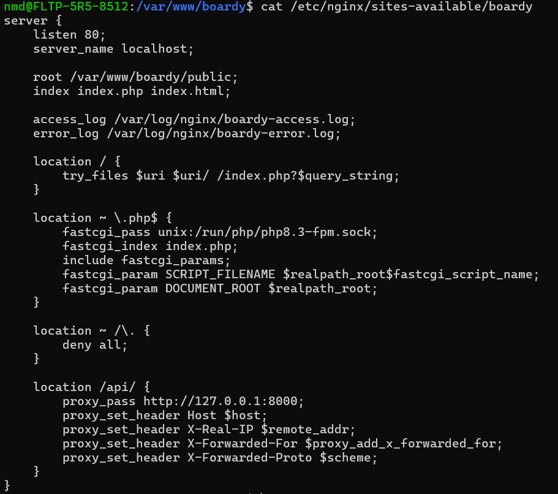

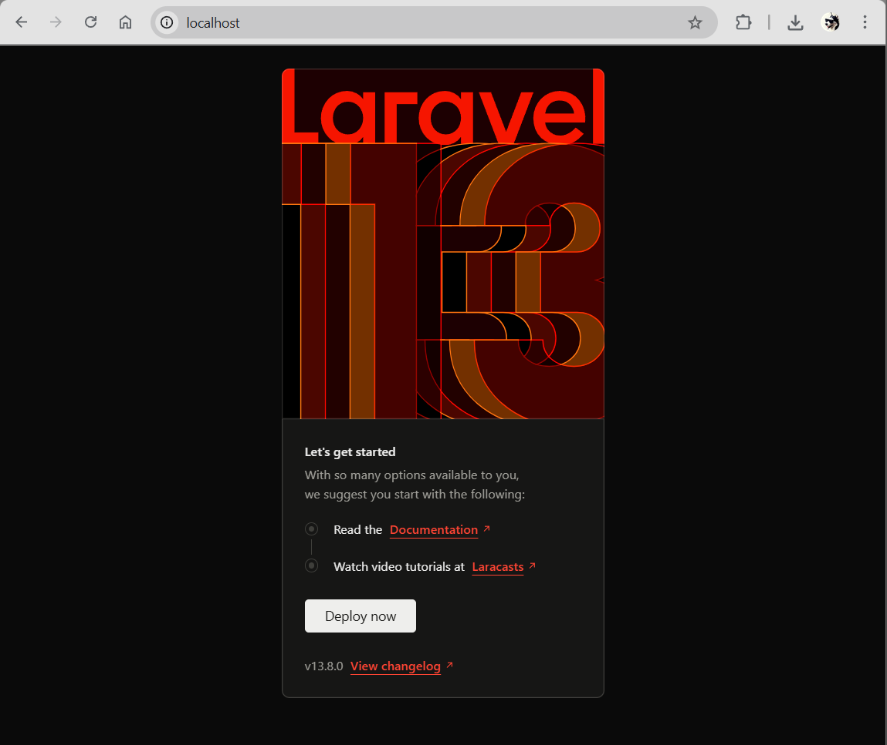

**Что делает `try_files $uri $uri/ /index.php?$query_string`? Что произойдёт без этой строки при заходе на `/posts/3`?**

`try_files` сначала проверяет, существует ли запрошенный путь как обычный файл (`$uri`) или директория (`$uri/`). Если такого файла нет, запрос передаётся в `/index.php` вместе с query string. Это нужно Laravel, потому что маршруты вроде `/posts`, `/posts/3`, `/login` физически не являются файлами на диске — их обрабатывает фреймворк через единый входной файл `public/index.php`.

Без этой строки Nginx пытался бы найти файл или папку `/posts/3` внутри `public/`. Такого файла нет, поэтому пользователь получил бы 404 от Nginx, а Laravel даже не увидел бы запрос.

---

# Часть B. БД, миграции, сидер

## Задание 5. Создание БД boardy_main

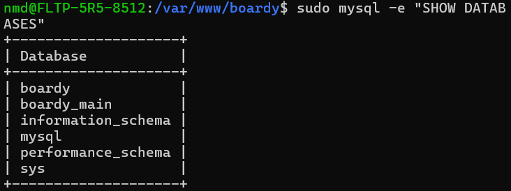

**Зачем мы создаём новую БД, а не подгоняем старую под Laravel? Что в схеме старой БД мешает?**

Новая база `boardy_main` нужна, чтобы Laravel сам управлял структурой через миграции. В старой базе `boardy` таблицы создавались вручную в предыдущих практиках под чистый PHP, поэтому структура не полностью совпадает с тем, что ожидают Laravel и Breeze.

Например, в старом варианте могли быть другие имена полей (`author_id` вместо `user_id`, `password_hash` вместо `password`), не было таблицы `migrations`, не все таблицы имели стандартные `created_at` и `updated_at`, а связи создавались под предыдущую реализацию. Если пытаться «допилить» старую базу, легко получить конфликт миграций, несовпадение моделей Eloquent и лишние ошибки. Поэтому старую БД сохраняем как legacy, а для Laravel используем чистую `boardy_main`.

## Задание 6. Подключение Laravel к БД

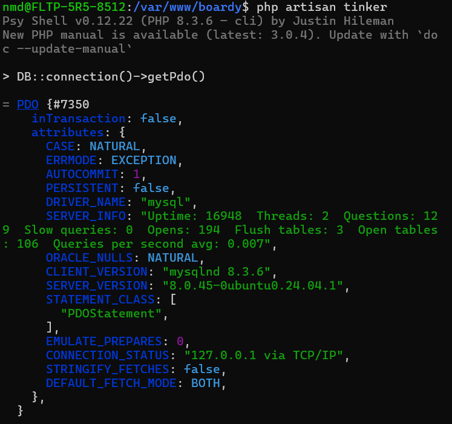

## Задание 7. Миграции posts и comments

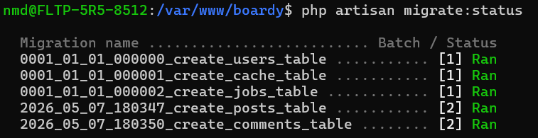

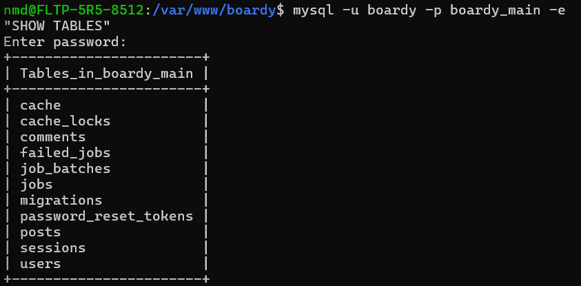

## Задание 8. Модели со связями

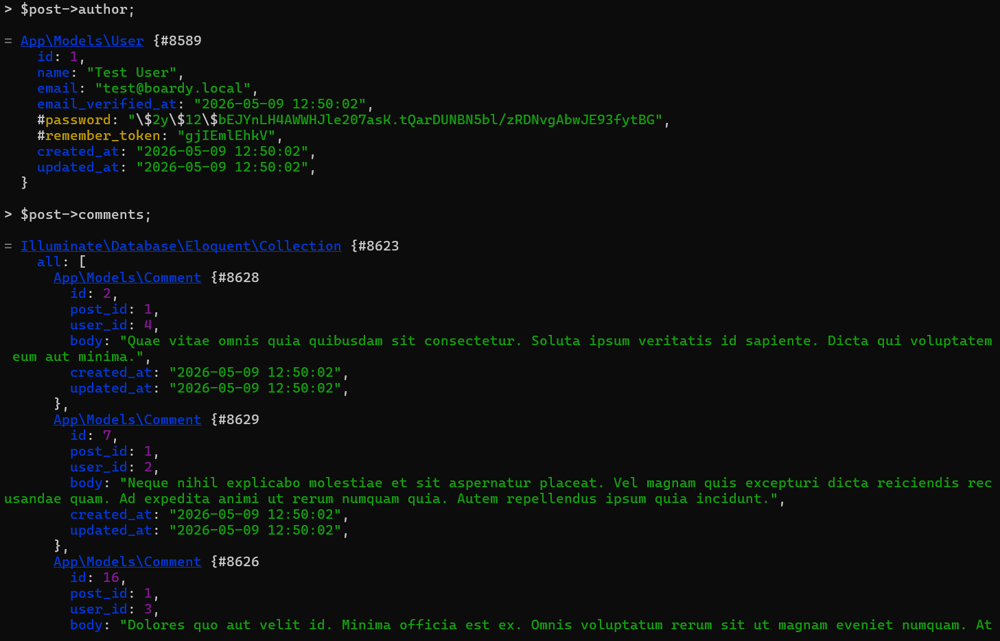

## Задание 9. Сидер

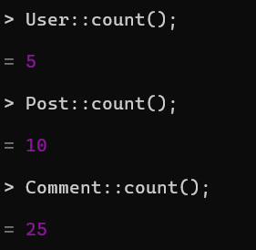

---

# Часть C. CRUD постов и комментариев

## Задание 10. Маршруты

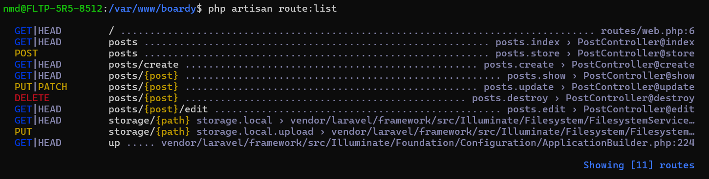

## Задание 11. Лента постов

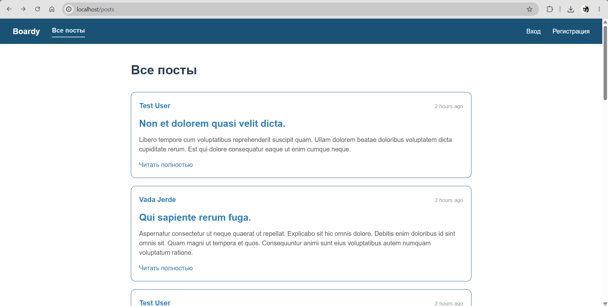

## Задание 12. Страница поста с комментариями

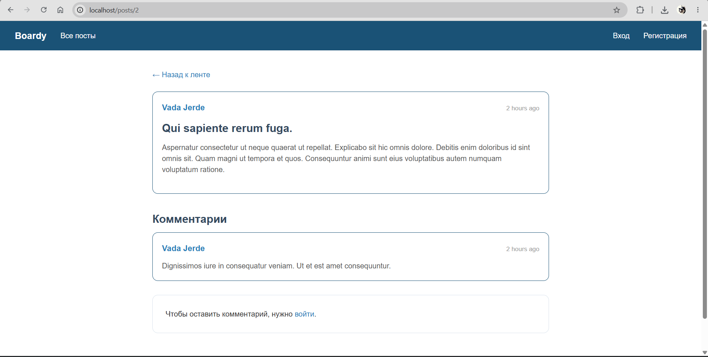

## Задание 13. Создание поста

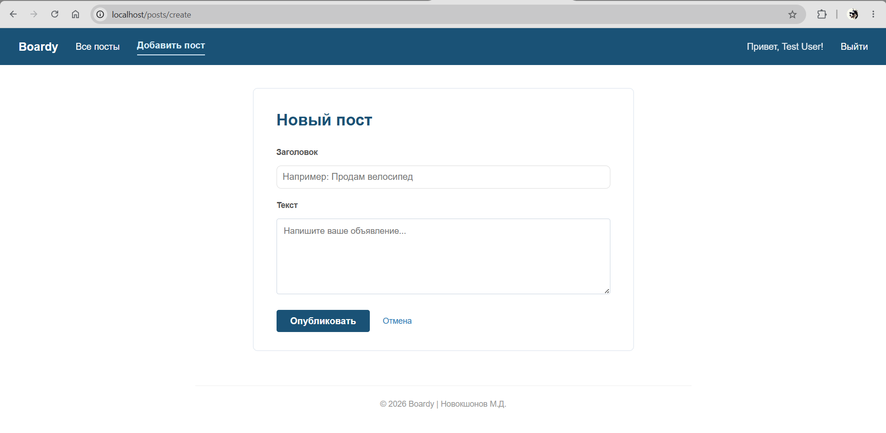

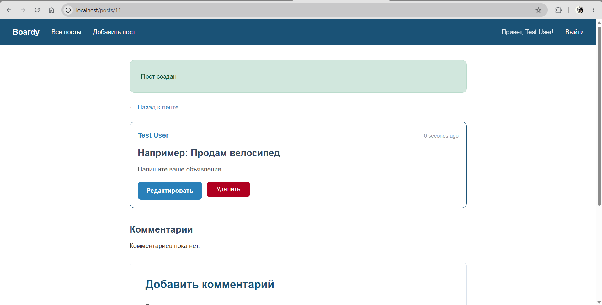

## Задание 14. Policy и редактирование

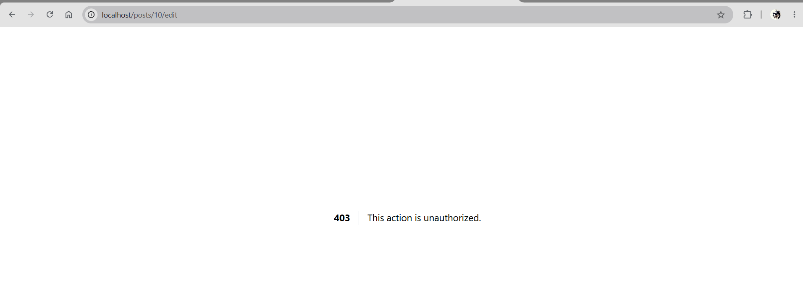

**Сравните Policy с тем, как авторизация была реализована в Lab10–11 на чистом PHP. Сколько строк кода ушло на тот же эффект?**

В Lab10–11 проверка прав делалась вручную: нужно было запускать сессию, проверять `$_SESSION['user_id']`, делать SQL-запрос к посту, сравнивать автора поста с текущим пользователем, писать редирект или ошибку доступа. Такие проверки приходилось повторять в разных файлах: при открытии формы, при сохранении изменений, при удалении.

В Laravel эта логика вынесена в `PostPolicy`: методы `update()` и `delete()` сравнивают `$user->id` с `$post->user_id`. В контроллере остаётся короткий вызов `$this->authorize(...)`, а в Blade — `@can`. То есть вместо повторяющихся ручных проверок на десятки строк получается один класс Policy и по одной строке в нужных местах. Код стал короче, централизованнее и безопаснее: меньше шансов забыть проверку на одной из страниц.

## Задание 15. Удаление поста

## Задание 16. Комментарий через Blade

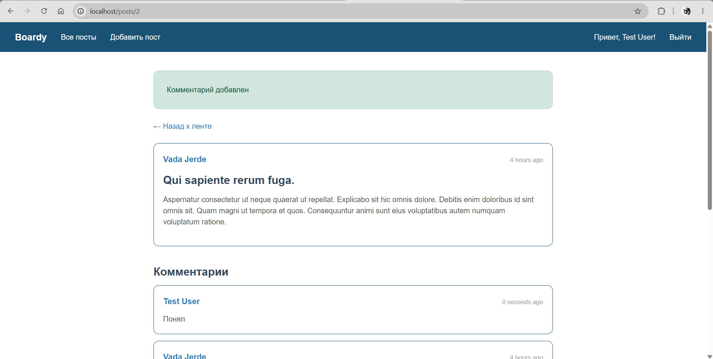

---

# Часть D. Breeze + Socialite

## Задание 17. Установка Breeze

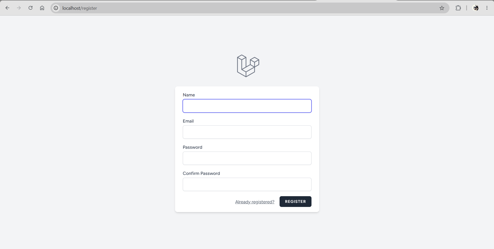

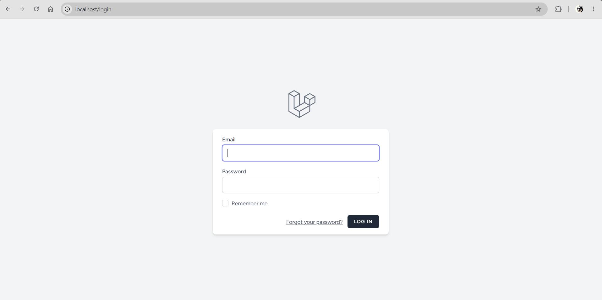

## Задание 18. Регистрация и вход

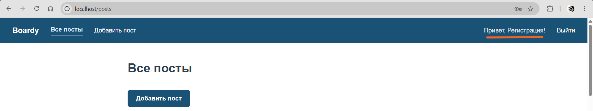

## Задание 19. GitHub OAuth-приложение

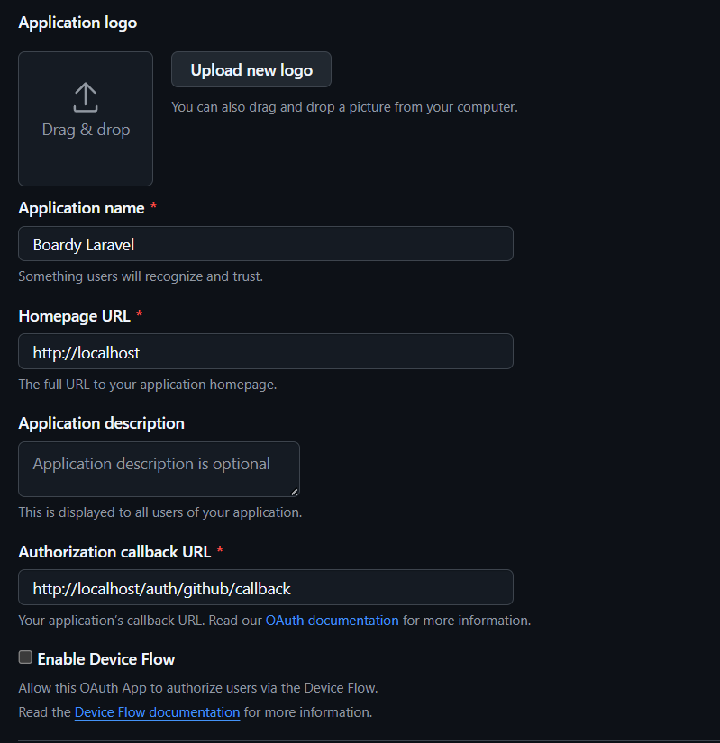

## Задание 20. Socialite

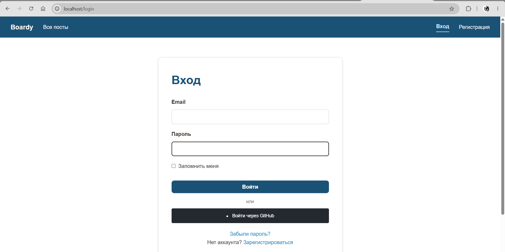

## Задание 21. Полный OAuth flow

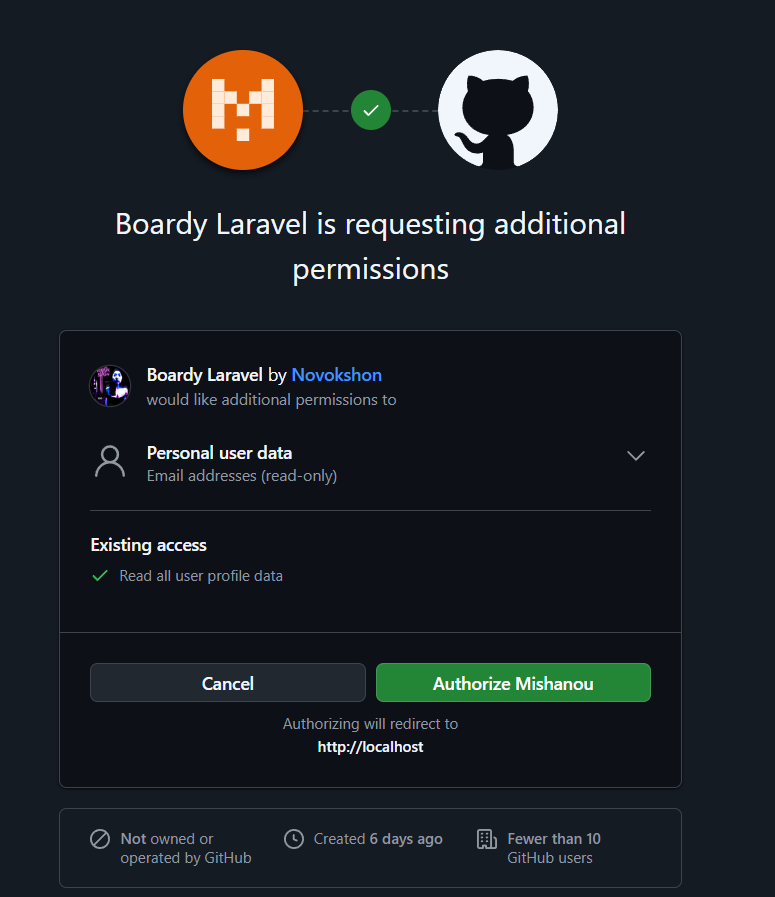

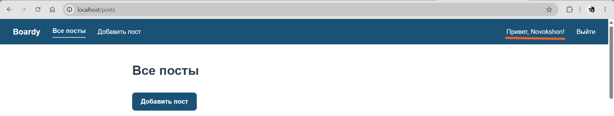

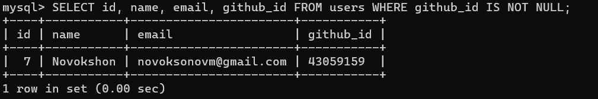

**Сравните количество строк кода Lab11: ручной OAuth на чистом PHP и Lab12: Socialite. Что сократилось и за счёт чего?**

В Lab11 OAuth приходилось реализовывать вручную: создавать `state`, сохранять его в сессии, собирать URL авторизации, обрабатывать callback, проверять `state`, обменивать `code` на access token через HTTP-запрос, отдельно запрашивать профиль GitHub, разбирать JSON, искать или создавать пользователя, запускать сессию и делать редирект.

В Lab12 большую часть этого берёт на себя Socialite. В контроллере остаются два основных действия: `Socialite::driver('github')->redirect()` для отправки пользователя на GitHub и `Socialite::driver('github')->user()` для получения профиля после callback. Сократился код HTTP-запросов, ручная обработка токена, разбор JSON и технические детали OAuth-flow. Приложение всё ещё само решает, как найти или создать пользователя, но низкоуровневую OAuth-механику выполняет пакет.

---

# Часть E. Архитектурные вопросы

## Задание 22. Что осталось от прошлых практик

Старую папку `/var/www/boardy-legacy/` и старую базу `boardy` не удаляем по двум причинам. Во-первых, это резервная копия предыдущей рабочей реализации на чистом PHP: по ней можно сравнивать поведение, дизайн и структуру данных. Во-вторых, предыдущие практики остаются частью истории проекта, а Laravel-версия — это просто переезд на удобный фреймворк.

Если попробовать открыть старый PHP-логин по адресу вида `/login.php`, он не откроется, потому что Nginx теперь смотрит в Laravel `public/`, где такого файла нет. Такой запрос попадёт в Laravel и завершится 404. Старый код лежит на сервере, но не является активной публичной версией сайта.

## Задание 23. FastAPI и React

FastAPI и React из прошлых практик сейчас не используются внутри Laravel-проекта, потому что в Lab12 основной фокус — перенести посты, комментарии, авторизацию и OAuth в Laravel. Laravel теперь сам отвечает за SSR-страницы, Blade-шаблоны, сессии, пользователей, посты и комментарии.

Интегрировать старый React-клиент прямо сейчас мешает разделение авторизации. Laravel знает пользователя через свою сессию, а FastAPI сам по себе эту Laravel-сессию не понимает. Нужно договориться, как API будет проверять пользователя: через токены, через отдельный auth-сервер или через проксирование. Также надо решить, кто является владельцем комментариев: Laravel через Blade или FastAPI через REST API.

В Lab13 React можно будет вернуть как клиентскую часть для динамических комментариев или уведомлений, FastAPI — как сервис для API/WebSocket, а Laravel будет источником авторизации и событий.

## Задание 24. Реалтайм

Сейчас комментарии появляются только после обновления страницы, потому что браузер получает HTML один раз и не держит постоянного канала связи с сервером. Чтобы один пользователь увидел комментарий другого без F5, нужен realtime-канал: WebSocket или похожий механизм событий.

Кандидаты на серверную часть — Laravel и FastAPI. Laravel удобен тем, что именно он сейчас создаёт комментарии и знает авторизованного пользователя. Но держать постоянные WebSocket-соединения чаще удобнее в асинхронном сервисе, поэтому FastAPI тоже хороший кандидат: он уже использовался как API-сервис и может обслуживать WebSocket-подключения.

Архитектурно можно сделать так: Laravel создаёт комментарий и публикует событие, например через Redis Pub/Sub. FastAPI подписывается на эти события и рассылает их всем подключённым браузерам по WebSocket. Тогда Laravel остаётся владельцем бизнес-логики и базы, а FastAPI отвечает за постоянные соединения и доставку realtime-уведомлений.
