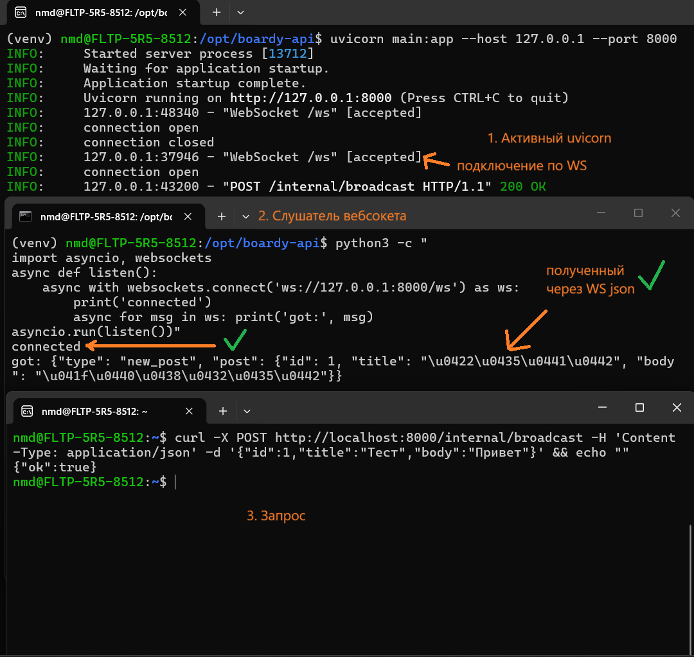
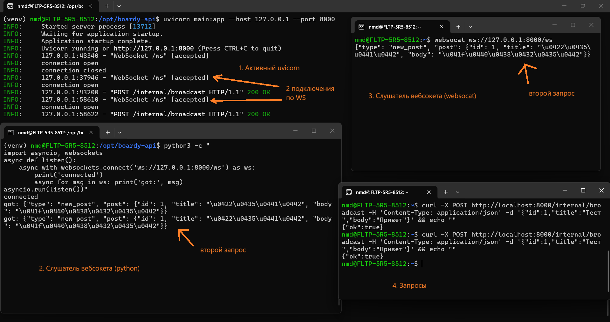
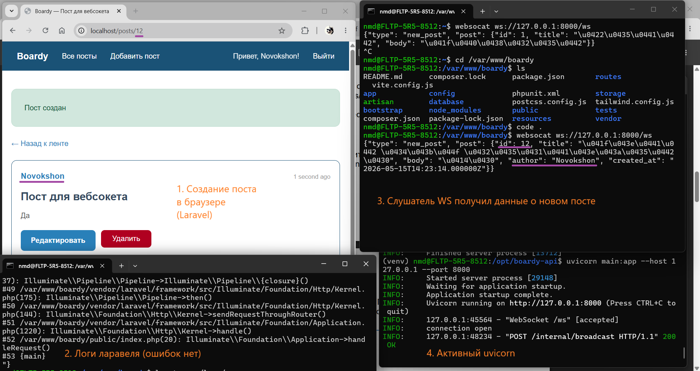
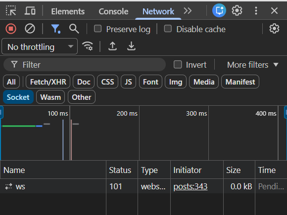
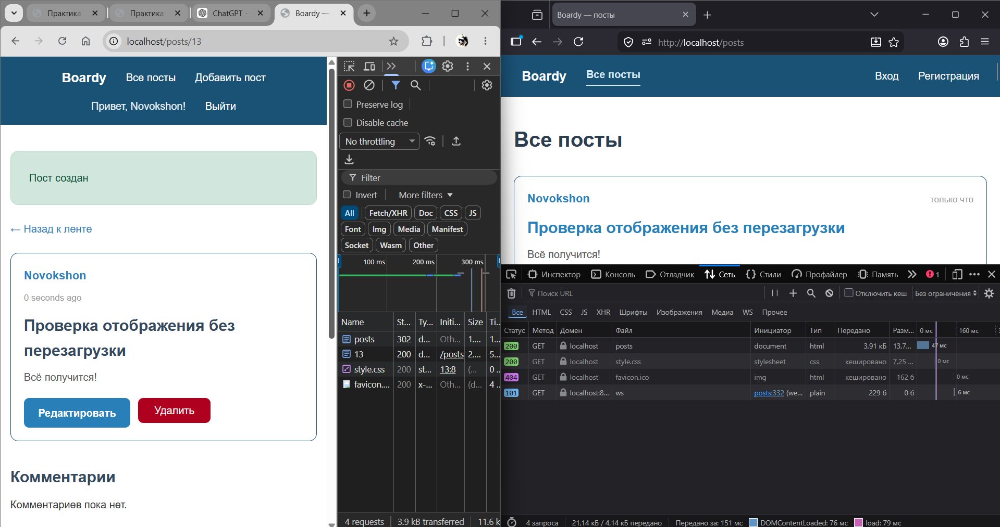
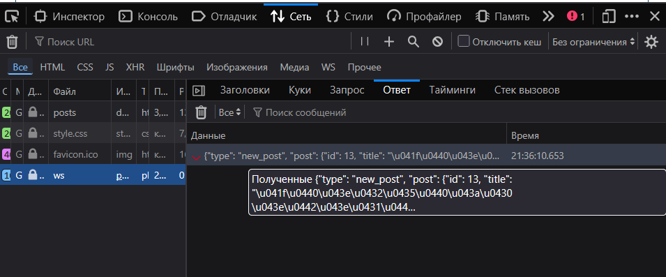
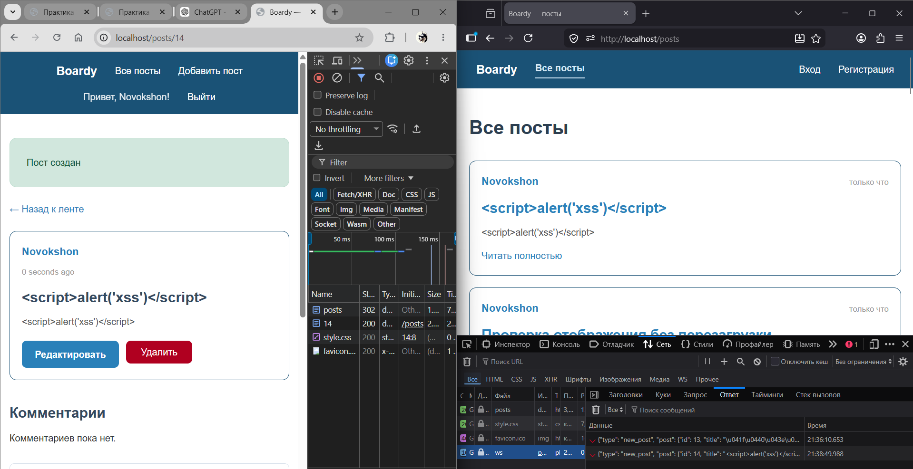
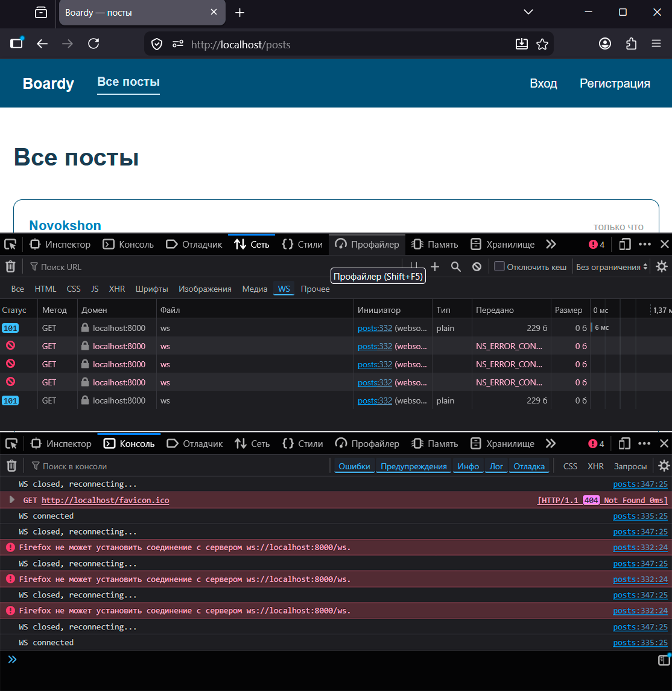
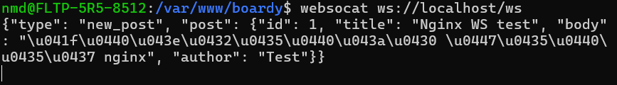
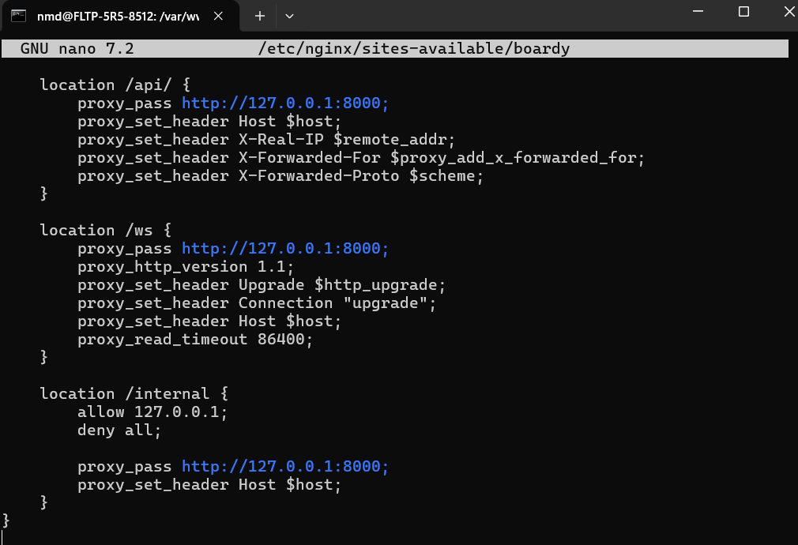

# Часть A. FastAPI: WebSocket

## Задание 1. ConnectionManager

`ConnectionManager` хранит активные WebSocket-подключения в списке `self.active`, потому что это временное состояние работающего процесса, а не постоянные данные приложения. Подключение существует только пока открыт браузер или CLI-клиент, поэтому хранить его в базе данных нет смысла: в БД можно сохранить запись о пользователе или посте, но не живой TCP/WebSocket-сокет.

Если Uvicorn перезапустится, список `self.active` очистится, потому что он находится в памяти процесса. Старые WebSocket-соединения оборвутся, а клиенты должны будут подключиться заново. Для этого на клиенте добавлено автоматическое переподключение через `setTimeout(connect, 3000)`.

## Задание 2. /internal/broadcast

Отдельный скриншот `02-broadcast.png` не делался, потому что проверка `curl POST /internal/broadcast` и получение JSON WebSocket-клиентом уже показаны на скриншоте `01-ws-connected.png`.

`/internal/broadcast` не требует JWT-авторизации, потому что этот endpoint не предназначен для обычных пользователей браузера. Его вызывает Laravel-сервер после создания поста, то есть это внутренний служебный callback между двумя backend-сервисами.

Риск остаётся в том, что без ограничения доступа любой внешний пользователь мог бы отправить POST-запрос на `/internal/broadcast` и разослать фальшивое событие всем WebSocket-клиентам. Этот риск закрывается на уровне Nginx: для `/internal` разрешается только локальный адрес `127.0.0.1`, а остальные клиенты блокируются через `deny all`.

## Задание 3. Два клиента

Если один из клиентов отключился, а broadcast уже начался, сервер попробует отправить сообщение этому клиенту. При ошибке отправки такое соединение нужно удалить из списка активных подключений, чтобы следующие рассылки не пытались писать в мёртвый сокет.

Это обрабатывается в коде `ConnectionManager.broadcast()`: отправка выполняется для каждого соединения, а проблемные соединения удаляются из `self.active`. Также при штатном отключении клиента срабатывает обработка `WebSocketDisconnect`, после чего вызывается `manager.disconnect(websocket)`.

---

# Часть B. Laravel: HTTP-callback

## Задание 4. PostController

Отдельный скриншот `04-laravel-log.png` не делался, потому что проверка отсутствия ошибки `WS broadcast failed` отражена вместе с полной проверкой callback на скриншоте `05-callback.png`: пост создан через Laravel, FastAPI получил `POST /internal/broadcast`, а WebSocket-слушатель получил данные о новом посте.

`timeout(2)` нужен, чтобы Laravel не ждал ответ FastAPI слишком долго. Создание поста — основное действие пользователя, а WebSocket-рассылка — дополнительное уведомление. Если FastAPI зависнет или станет недоступен, Laravel должен быстро продолжить работу и сохранить пост, а не держать пользователя на странице ожидания.

Если FastAPI недоступен и timeout не указан, HTTP-запрос из Laravel может ждать слишком долго. В результате создание поста будет визуально тормозить или зависать, хотя сам пост уже может быть создан в базе. Поэтому вызов обёрнут в `try/catch`: ошибка broadcast записывается в лог, но не ломает основной сценарий создания поста.

## Задание 5. Проверка callback

Проблема этой архитектуры в том, что Laravel и FastAPI связаны прямым HTTP-вызовом. Такой HTTP-callback называют костылём, потому что он работает, но плохо масштабируется и создаёт жёсткую зависимость между сервисами.

Конкретные проблемы:

1. Laravel должен знать точный адрес FastAPI и endpoint `/internal/broadcast`, поэтому сервисы становятся сильно связаны друг с другом.
2. Если FastAPI недоступен, Laravel получает ошибку или ждёт timeout, хотя создание поста логически не должно зависеть от WebSocket-сервиса.
3. При большом числе событий Laravel будет делать много HTTP-запросов в FastAPI, что может создать лишнюю нагрузку и задержки.
4. Нет нормальной очереди событий: если FastAPI был выключен в момент создания поста, событие просто потеряется.

Более правильная архитектура для этого сценария — Redis Pub/Sub или очередь: Laravel публикует событие в Redis, а FastAPI подписывается на канал и рассылает события WebSocket-клиентам.

---

# Часть C. JS клиент

## Задание 6. WebSocket в Blade

На локальной разработке используется `ws://`, потому что соединение идёт без TLS. В WSL проект работает через обычный HTTP на `localhost`, без HTTPS-сертификата, поэтому WebSocket тоже должен быть обычным: `ws://localhost:8000/ws` или через Nginx `ws://localhost/ws`.

На проде используется `wss://`, потому что сайт работает по HTTPS. `wss://` — это WebSocket поверх TLS, аналогично тому как `https://` является HTTP поверх TLS.

Если использовать `wss://` без настроенного TLS-сертификата, браузер не сможет установить соединение. Возникнет ошибка протокола или ошибка TLS, потому что клиент ожидает защищённое соединение, а сервер отдаёт обычный незашифрованный WebSocket.

## Задание 7. Два браузера

Пост был создан в одном браузере, после чего Laravel отправил событие в FastAPI через `/internal/broadcast`. FastAPI разослал событие всем активным WebSocket-клиентам. Во втором браузере страница `/posts` получила входящий JSON-фрейм и добавила карточку поста в ленту без перезагрузки страницы.

## Задание 8. XSS

Функция `escapeHtml()` защищает вставку пользовательских данных в `innerHTML`. Она создаёт временный `div`, кладёт строку в `textContent`, а затем забирает безопасную HTML-строку через `innerHTML`. В результате символы вроде `<`, `>`, `&`, кавычек превращаются в HTML-сущности и отображаются как обычный текст.

Если вставить данные напрямую в `innerHTML` без экранирования, браузер начнёт воспринимать пользовательский ввод как HTML-код. Тогда строка вроде `` или HTML с обработчиком `onerror` может выполнить JavaScript в браузере другого пользователя. Это классическая XSS-уязвимость.

## Задание 9. Переподключение

При остановке Uvicorn старое WebSocket-соединение закрывается. В обработчике `ws.onclose` клиент пишет сообщение в консоль и через несколько секунд снова вызывает `connect()`. После повторного запуска Uvicorn браузер устанавливает новое соединение, что видно в DevTools: старые попытки подключения завершились ошибкой, а новое соединение снова получило статус `101`.

---

# Часть D. Nginx

## Задание 10. WS-проксирование

В локальной WSL-среде вместо продового `wss://api.novokshon.ai-info.ru/ws` использовался локальный адрес `ws://localhost/ws`, потому что проект запускается без публичного домена и без HTTPS. Запрос `/ws` принимает Nginx и проксирует его в FastAPI на `127.0.0.1:8000`.

Если убрать `proxy_http_version 1.1`, WebSocket может не заработать, потому что переключение протокола через `Upgrade` рассчитано на HTTP/1.1. На старом HTTP/1.0 такого механизма нет.

Если убрать `proxy_set_header Upgrade $http_upgrade`, Nginx не передаст FastAPI запрос на переключение протокола. В результате сервер увидит обычный HTTP-запрос, а не попытку открыть WebSocket-соединение.

Если убрать `proxy_read_timeout 86400`, Nginx может закрыть WebSocket-соединение по таймауту, даже если оно должно оставаться открытым долго. Для WebSocket это критично, потому что соединение специально держится открытым для получения событий в реальном времени.

## Задание 11. Закрыть /internal

В условиях WSL внешний IP для честной проверки `403 Forbidden` отсутствует, поэтому вместо внешнего curl показан конфиг Nginx, где `/internal` ограничен директивами `allow 127.0.0.1; deny all;`. Локальные запросы из WSL разрешены, потому что Laravel и FastAPI работают на одной машине и обращаются друг к другу через localhost.

`/internal/broadcast` опасен без ограничения доступа, потому что этот endpoint рассылает событие всем подключённым WebSocket-клиентам. Если оставить его открытым наружу, любой человек смог бы отправить POST-запрос и создать фальшивое real-time уведомление, не создавая настоящий пост через Laravel и не проходя авторизацию.

Такой endpoint могли бы вызвать:

1. обычный внешний пользователь через `curl` или Postman;
2. злоумышленник со своего сайта или скрипта;
3. бот, который перебирает открытые служебные endpoint'ы.

Поэтому `/internal` должен быть доступен только локально для backend-сервисов, а внешний доступ должен блокироваться на уровне Nginx.
