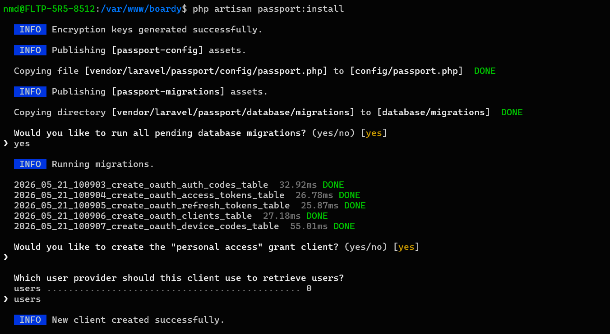
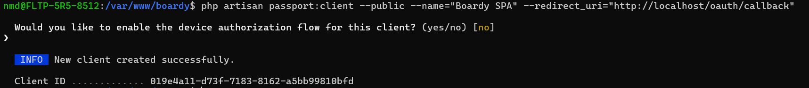
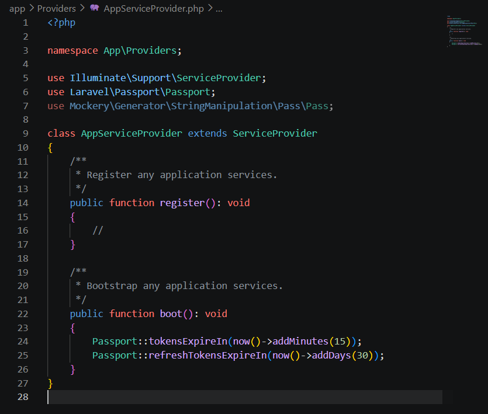
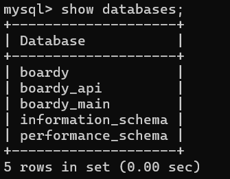
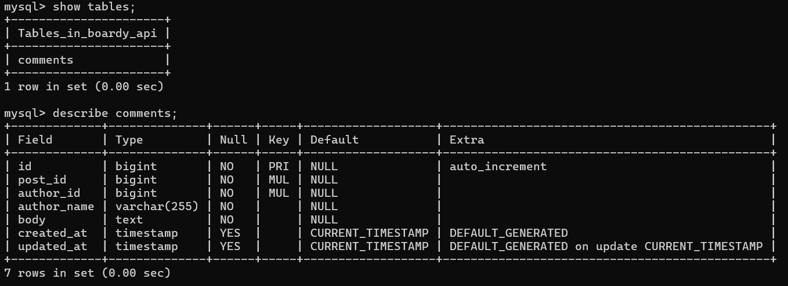
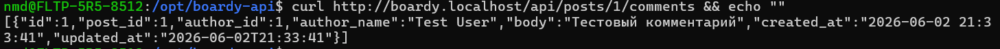
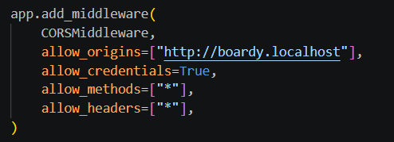
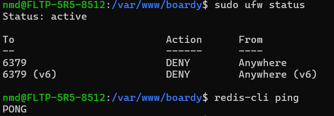
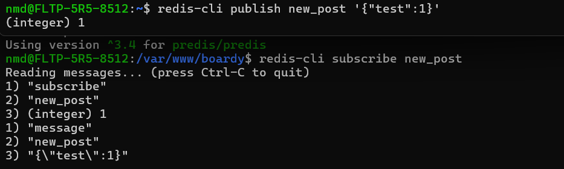
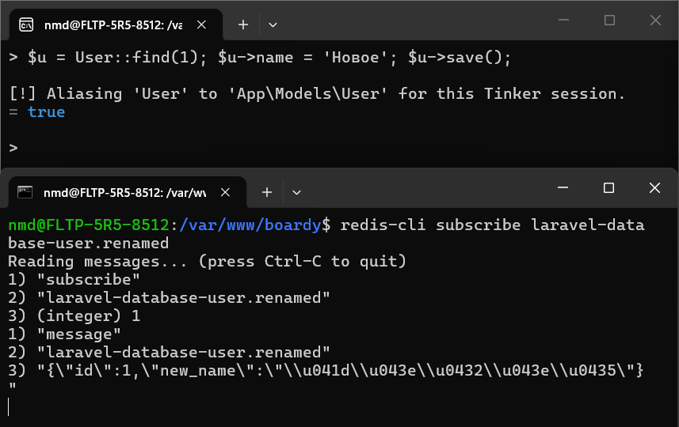

# Практика 14. Финальная микросервисная архитектура

## Часть А. Passport как OAuth 2.1 сервер

### Задание 1. Установка и SPA-клиент

**Почему публичный клиент создаётся без client_secret? Чем PKCE заменяет client_secret и от какой атаки защищает?**

SPA-приложение выполняется в браузере пользователя, поэтому любой встроенный client_secret может быть просмотрен через DevTools. По этой причине публичные клиенты OAuth работают без секрета. Вместо client_secret используется механизм PKCE. Клиент генерирует случайный code_verifier, вычисляет из него code_challenge и отправляет challenge на этапе авторизации. При обмене authorization code на токен сервер требует исходный verifier и проверяет соответствие challenge. Это защищает от перехвата authorization code и его использования злоумышленником.

---

### Задание 2. TTL и refresh

**Почему access_token короткий, а refresh_token длинный? Что произойдёт если access_token будет действовать 24 часа?**

Access token используется при каждом запросе к API, поэтому срок его жизни должен быть небольшим. Если такой токен будет украден, злоумышленник сможет пользоваться API только ограниченное время.

Refresh token используется только для получения нового access token, поэтому его срок жизни может быть значительно больше.

Если access token будет действовать 24 часа, то при его компрометации злоумышленник получит доступ к API на целые сутки без необходимости повторной авторизации.

---

### Задание 3. Проверка выдачи через curl

**Какие шаги OAuth flow прошёл этот curl-запрос?**

1. Был сгенерирован code_verifier.
2. Из него был вычислен code_challenge.
3. Клиент отправил пользователя на `/oauth/authorize`.
4. После подтверждения доступа сервер выдал authorization code.
5. Клиент отправил code и исходный code_verifier на `/oauth/token`.
6. Passport проверил соответствие verifier и challenge.
7. После успешной проверки были выданы access_token и refresh_token.

---

## Часть Б. Две базы данных

### Задание 4. Создание boardy_api

**Почему в comments нет внешних ключей на posts и users? Что делать с целостностью данных?**

Таблица comments находится в отдельной базе данных FastAPI-сервиса. Таблицы users и posts находятся в базе Laravel. Между разными базами данных и сервисами невозможно удобно использовать внешние ключи.

Целостность данных обеспечивается на уровне приложения. Laravel и FastAPI должны самостоятельно проверять существование необходимых сущностей и корректно обрабатывать их удаление.

---

### Задание 5. FastAPI подключён к новой БД

---

## Часть В. FastAPI: RS256 + полный CRUD

### Задание 6. RS256

**Почему RS256 безопаснее HS256 для распределённых систем?**

При HS256 один и тот же секрет используется и для подписи, и для проверки токенов. Поэтому каждый сервис, который проверяет JWT, должен знать секретный ключ.

При RS256 приватный ключ хранится только у сервиса авторизации. Остальные сервисы получают только публичный ключ и могут лишь проверять подпись, но не создавать собственные токены. Это делает архитектуру безопаснее и лучше подходит для микросервисов.

---

### Задание 7. CRUD комментариев

**Почему author_name передаётся в payload запроса, а не извлекается из JWT? Что было бы если зашить имя в JWT?**

Имя пользователя может изменяться. Если сохранять его в JWT, то после смены имени пришлось бы перевыпускать все токены.

Передача author_name отдельно позволяет хранить актуальное отображаемое имя в комментариях и обновлять его независимо от срока жизни JWT.

---

### Задание 8. Owner check

**Где проверяется владелец? Что произойдёт если убрать проверку?**

Проверка владельца выполняется в FastAPI перед изменением или удалением комментария. Сравнивается идентификатор пользователя из токена и идентификатор автора комментария.

Если убрать эту проверку, любой авторизованный пользователь сможет изменять и удалять чужие комментарии.

---

### Задание 9. CORS

**Почему allow_origins=['*'] вместе с credentials=true браузер блокирует? Что произошло бы с куками?**

Разрешение всех источников вместе с передачей учётных данных запрещено стандартом CORS. Браузер блокирует такую конфигурацию для предотвращения утечки пользовательских данных.

Если бы это было разрешено, сторонние сайты могли бы отправлять запросы от имени пользователя вместе с его куками.

---

## Часть Г. React PKCE Flow

### Задание 10. PKCE утилиты

**Почему code_challenge передаётся в /authorize, а code_verifier — в /token? Что будет если перепутать?**

На этапе авторизации сервер ещё не должен знать исходный verifier. Поэтому клиент передаёт только его хэшированное представление — challenge.

На этапе обмена кода на токен клиент раскрывает исходный verifier. Сервер вычисляет challenge повторно и сравнивает значения.

Если передать verifier сразу или перепутать параметры местами, PKCE-проверка не пройдёт и токен выдан не будет.

---

### Задание 11. Login flow

При нажатии кнопки входа React формирует параметры OAuth-запроса, сохраняет verifier и state в sessionStorage и выполняет редирект на `/oauth/authorize`.

---

### Задание 12. Обмен code на токены

**Что произойдёт если убрать проверку state? Какая атака возможна?**

Параметр state защищает от CSRF-атак в OAuth flow.

Если убрать его проверку, злоумышленник сможет подменить ответ авторизации и навязать пользователю собственный authorization code.

---

### Задание 13. Refresh token в HttpOnly cookie

**Что случится если refresh_token хранить в localStorage и сайт получит XSS?**

JavaScript сможет прочитать refresh token из localStorage и отправить его злоумышленнику.

При использовании HttpOnly cookie доступ к refresh token из JavaScript отсутствует, поэтому XSS не позволяет напрямую украсть этот токен.

---

### Задание 14. Silent refresh

При истечении срока действия access token React автоматически получает новый токен через refresh token и повторяет исходный запрос без участия пользователя.

---

## Часть Д. Redis Pub/Sub

### Задание 15. Redis

---

### Задание 16. Redis publish

**Чем Redis::publish архитектурно лучше Http::post() в FastAPI?**

При использовании Http::post Laravel напрямую зависит от доступности FastAPI.

Redis Pub/Sub разрывает эту жёсткую связь. Laravel публикует событие в Redis, а FastAPI самостоятельно подписывается на нужные каналы. Такая архитектура лучше масштабируется и уменьшает связанность сервисов.

---

### Задание 17. FastAPI subscriber

FastAPI запускает фоновую задачу, которая подписывается на каналы Redis и обрабатывает поступающие события.

---

### Задание 18. User Observer

**Почему UserObserver вызывается автоматически? Где находится магия Laravel?**

Observer регистрируется через `User::observe(...)`.

После регистрации Laravel автоматически вызывает соответствующие методы observer при событиях модели (`created`, `updated`, `deleted` и другие). В данном случае метод `updated()` вызывается после изменения пользователя.

---

### Задание 19. Денормализация имени

**Что такое eventual consistency? Когда между сменой имени и обновлением comments может быть задержка?**

Eventual consistency означает, что данные в разных сервисах становятся согласованными не мгновенно, а спустя некоторое время.

После изменения имени Laravel публикует событие в Redis. FastAPI получает его, обновляет комментарии и синхронизирует данные. Между этими действиями возможна небольшая задержка, связанная с обработкой события и сетевым взаимодействием.

---

## Часть Е. Финальные проверки

### Задание 20. Реалтайм посты

После публикации нового поста Laravel отправляет событие в Redis. FastAPI получает его и рассылает обновление всем подключённым WebSocket-клиентам.

---

### Задание 21. Реалтайм комментарии

Операции создания, изменения и удаления комментариев синхронизируются между клиентами через WebSocket без перезагрузки страницы.

---

### Задание 22. Отсутствие прямых HTTP-вызовов

В итоговой архитектуре прямые HTTP-запросы между Laravel и FastAPI отсутствуют.

Обмен событиями выполняется через Redis Pub/Sub. Благодаря этому сервисы остаются независимыми друг от друга и могут масштабироваться отдельно.
