# Часть A. Dockerfile для Laravel

## Задание 1. PHP-FPM с расширениями

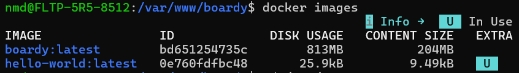

Использование выделенного контейнера с PHP-FPM вместо монолитной связки Apache + PHP является стандартом современной микросервисной архитектуры и предоставляет ключевые преимущества:

1. **Разделение ответственности (Single Responsibility Principle):** Веб-сервер (Nginx) и интерпретатор языка (PHP-FPM) работают как изолированные сервисы. Nginx эффективно обрабатывает статические файлы, занимается терминированием SSL-сертификатов, кэшированием и ограничением частоты запросов (rate limiting), передавая в PHP-FPM только динамические запросы через быстрый протокол FastCGI.
2. **Независимое масштабирование:** В Docker Compose мы можем гибко масштабировать только те компоненты, которые создают бутылочное горлышко. Если приложение начинает испытывать высокую вычислительную нагрузку, можно запустить несколько реплик контейнера `laravel` (PHP-FPM), оставив при этом один легковесный контейнер `nginx` для распределения трафика между ними.
3. **Эффективность использования ресурсов:** Apache порождает тяжелые процессы на каждое соединение, резервируя память под встроенный модуль PHP даже при отдаче простой картинки. Связка Nginx + PHP-FPM потребляет в разы меньше RAM и способна обрабатывать значительно большее количество конкурентных соединений (high load).

## Задание 2. Кеширование composer-зависимостей

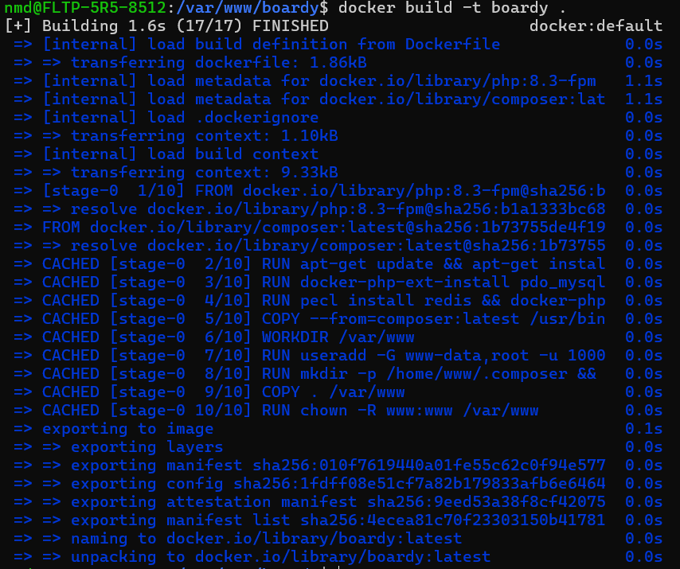

Docker собирает образы послойно, интерпретируя каждую строчку в `Dockerfile` (`COPY`, `RUN` и т.д.) как отдельный неизменяемый слой. Механизм кэширования проверяет: если файлы, участвующие в команде, не изменялись с момента прошлого билда, Docker не выполняет команду заново, а мгновенно берет готовый результат из кэша (`CACHED`).

Если выполнить инструкцию `COPY . .` (копирование всего проекта) **ДО** вызова `composer install`, то при абсолютно любом, даже минимальном изменении кода (например, изменении одной буквы в контроллере или Blade-шаблоне), кэш для слоя копирования будет полностью аннулирован (инвалидирован). Соответственно, все последующие слои, включая `composer install`, Docker будет вынужден выполнять с нуля. Это приведет к тому, что при каждом изменении кода сборка будет зависать на несколько минут, скачивая сотни мегабайт внешних пакетов из интернета.

Раздельный подход (сначала `COPY composer.json composer.lock`, затем `RUN composer install`, и только в конце `COPY . .`) гарантирует, что тяжелый слой скачивания зависимостей будет пересобираться исключительно тогда, когда разработчик действительно изменил состав пакетов в конфигурационных файлах Composer.

## Задание 3. .dockerignore

```
# Зависимости и пакеты (они должны устанавливаться внутри контейнера)
/vendor
/node_modules
/public/build

# Конфигурационные файлы с секретами (используются переменные окружения)
.env
.env.production
.env.local

# Системные файлы контроля версий и IDE
.git
.github
.gitignore
.gitattributes
.idea
.vscode
*.suo
*.ntvs*
*.njsproj
*.sln
*.swp

# Логи и кэш приложения Laravel
/storage/logs/*.log
/storage/framework/cache/data/*
/storage/framework/sessions/*
/storage/framework/views/*.php
/bootstrap/cache/*.php

# Кэш тестов и инструменты отладки
.phpunit.result.cache
.phpunit.cache
Homestead.json
Homestead.yaml
_ide_helper*.php
.phpstan
.php_cs.cache

# Кэш сборщиков фронтенда и логи ошибок
npm-debug.log
yarn-error.log
.eslintcache

# Системные файлы операционных систем
.DS_Store
Thumbs.db
```

Если файл `.env` не будет явно добавлен в `.dockerignore`, локальный файл конфигурации скопируется внутрь Docker-образа в процессе выполнения команды `COPY`. Это порождает критические угрозы безопасности и нарушает методологию разработки:

1. **Утечка секретов (Data Leakage):** Docker-образы часто загружаются в реестры (Docker Hub, GitHub Packages). Если образ с зашитым локальным `.env` попадет в сеть, любой человек, скачавший его, сможет легко извлечь пароли от баз данных, приватные ключи шифрования, токены интеграции с GitHub/соцсетями и административные доступы с помощью команд вроде `docker history` или путем запуска контейнера в интерактивном режиме.
2. **Нарушение концепции Twelve-Factor App:** Согласно стандартам разработки облачных приложений, код и конфигурация должны быть строго разделены. Docker-образ должен быть универсальным (одним и тем же для разработки, тестирования и продакшена). Конкретные переменные окружения и доступы должны передаваться в контейнер динамически извне в момент запуска, а не намертво фиксироваться на этапе сборки.

---

# Часть Б. Dockerfile для FastAPI

## Задание 4. requirements.txt

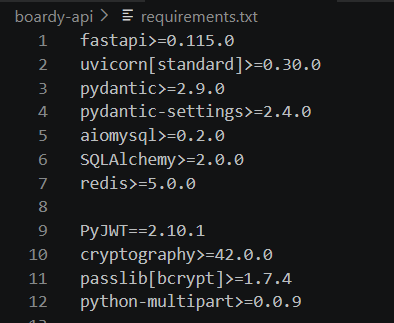

Использование строго фиксированных версий пакетов вместо записи `latest` или отсутствия указания версий необходимо для обеспечения **детерминированности и воспроизводимости сборки**.

Если не фиксировать версии зависимостей, то через год (или даже через месяц) при сборке проекта на чистой машине `pip` скачает самые последние версии библиотек. За это время разработчики FastAPI, Pydantic или SQLAlchemy могут выпустить мажорные обновления, полностью меняющие архитектуру кода, сигнатуры функций или логику валидации данных (как это произошло при масштабном переходе с Pydantic v1 на Pydantic v2). В результате проект, который идеально работал на компьютере автора, через год гарантированно сломается при попытке развертывания на сервере, выдав синтаксические ошибки или критические сбои во время исполнения (runtime errors).

## Задание 5. Сборка образа

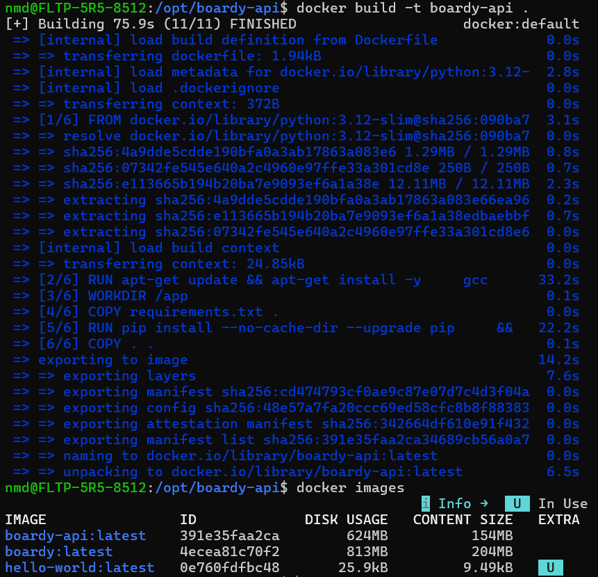

## Задание 6. CMD с правильным host

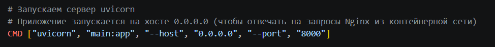

Сетевой интерфейс `127.0.0.1` (loopback) является локальной петлей, изолированной внутри конкретного пространства. Если запустить `uvicorn` с параметром `--host 127.0.0.1`, сервер будет слушать и принимать сетевые запросы **исключительно изнутри самого себя** (внутри данного контейнера).

Поскольку в Docker Compose каждый сервис (Nginx, Laravel, FastAPI) работает в своем собственном изолированном контейнере со своим сетевым пространством, веб-сервер Nginx не сможет проксировать запросы к FastAPI по адресу `127.0.0.1:8000` и будет постоянно возвращать ошибку `502 Bad Gateway` (или `Connection refused`).

Параметр `--host 0.0.0.0` указывает Uvicorn слушать входящие запросы на всех доступных сетевых интерфейсах контейнера. Это позволяет внешнему трафику из общей виртуальной Docker-сети (в частности, от контейнера Nginx) успешно доходить до приложения FastAPI.

---

# Часть В. Конфиг Nginx

## Задание 7. docker/nginx/default.conf

```
server {
    listen 80;
    server_name localhost;

    # Корневая директория публичной папки Laravel ВНУТРИ контейнера Nginx
    root /var/www/public;
    index index.php index.html;

    # Логи контейнера
    access_log /var/log/nginx/access.log;
    error_log /var/log/nginx/error.log;

    # Обработка обычных запросов и фронтенда Laravel
    location / {
        try_files $uri $uri/ /index.php?$query_string;
    }

    # Передача PHP-запросов в контейнер с Laravel по сети (порт 9000)
    location ~ \.php$ {
        fastcgi_pass laravel:9000;
        fastcgi_index index.php;
        include fastcgi_params;
        fastcgi_param SCRIPT_FILENAME $document_root$fastcgi_script_name;
        fastcgi_param DOCUMENT_ROOT $document_root;
    }

    # Запрет доступа к скрытым файлам (например, .env или .git)
    location ~ /\. {
        deny all;
    }

    # Проксирование запросов к API в контейнер FastAPI
    location /api/ {
        proxy_pass http://fastapi:8000;
        proxy_set_header Host $host;
        proxy_set_header X-Real-IP $remote_addr;
        proxy_set_header X-Forwarded-For $proxy_add_x_forwarded_for;
        proxy_set_header X-Forwarded-Proto $scheme;
    }

    # Проксирование WebSockets (для реалтайма) в контейнер FastAPI
    location /ws {
        proxy_pass http://fastapi:8000;
        proxy_http_version 1.1;
        proxy_set_header Upgrade $http_upgrade;
        proxy_set_header Connection "upgrade";
        proxy_set_header Host $host;
        proxy_read_timeout 86400;
    }
}
```

Внутри контейнера Nginx адрес `127.0.0.1:9000` указывает на сам контейнер Nginx, в котором PHP-FPM не установлен. Для перенаправления запросов в правильные места используются записи `laravel:9000` и `fastapi:8000`.

DockerCompose автоматически поднимает встроенный локальный DNS-сервер для созданной пользовательской сети (`boardy_net`). При старте контейнеров этот DNS-сервер берет имена сервисов, описанные в `docker-compose.yml` (`laravel`, `fastapi`, `mysql` и т.д.), и динамически сопоставляет их с внутренними IP-адресами, выделенными этим контейнерам в подсети. Благодаря этому разработчику не нужно вручную отслеживать динамические IP-адреса контейнеров — Docker осуществляет Service Discovery (разрешение имен) под капотом.

## Задание 8. WebSocket location

Для корректной работы WebSocket-соединения через Nginx в блоке `location /ws` настроен проброс заголовков `Upgrade` и `Connection`, сообщающий бэкенду о необходимости смены протокола со стандартного HTTP на дуплексный WebSocket (статус `101 Switching Protocols`), а директива `proxy_read_timeout 86400` предотвращает разрыв соединения со стороны прокси-сервера при длительном отсутствии сообщений (интервал увеличен до 24 часов).

---

# Часть Г. docker-compose.yml

## Задание 9. Пять сервисов

```
services:

  nginx:
    image: nginx:alpine
    container_name: boardy-nginx
    ports:
      - "80:80"
    volumes:
      - ./docker/nginx/default.conf:/etc/nginx/conf.d/default.conf:ro
      - ./boardy-laravel:/var/www
    depends_on:
      laravel:
        condition: service_started
      fastapi:
        condition: service_started
    networks:
      - boardy-network

  laravel:
    build:
      context: ./boardy-laravel
      dockerfile: Dockerfile
    container_name: boardy-laravel
    volumes:
      - ./boardy-laravel:/var/www
    depends_on:
      mysql:
        condition: service_healthy
      redis:
        condition: service_healthy
    networks:
      - boardy-network

  fastapi:
    build:
      context: ./boardy-api
      dockerfile: Dockerfile
    container_name: boardy-api
    volumes:
      - ./boardy-api:/app
    depends_on:
      mysql:
        condition: service_healthy
      redis:
        condition: service_healthy
    networks:
      - boardy-network

  mysql:
    image: mysql:8.4
    container_name: boardy-mysql
    restart: always
    env_file:
      - .env
    environment:
      MYSQL_ALLOW_EMPTY_PASSWORD: "no"
    volumes:
      - mysql-data:/var/lib/mysql
      - ./docker/mysql/init.sql:/docker-entrypoint-initdb.d/init.sql:ro
    healthcheck:
      test: ["CMD", "mysqladmin", "ping", "-h", "localhost", "-u", "root", "-p$$MYSQL_ROOT_PASSWORD"]
      interval: 5s
      timeout: 5s
      retries: 5
    networks:
      - boardy-network

  redis:
    image: redis:7-alpine
    container_name: boardy-redis
    restart: always
    volumes:
      - redis-data:/data
    healthcheck:
      test: ["CMD", "redis-cli", "ping"]
      interval: 5s
      timeout: 3s
      retries: 5
    networks:
      - boardy-network

networks:
  boardy-network:
    driver: bridge

volumes:
  mysql-data:
  redis-data:
```

## Задание 10. Volumes

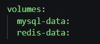

Файловая система любого контейнера является эфемерной (временной) по своей природе. Все изменения, записанные внутри запущенного контейнера, физически сохраняются в специальном временном слое (writable layer). Если удалить контейнер через команду `docker compose down`, этот слой полностью уничтожается.

Если убрать постоянный объем `mysql_data`, то при каждой остановке инфраструктуры (`docker compose down`) все накопленные данные - созданные пользователи, написанные посты, логи и связи - будут **стерты**. При следующем запуске СУБД MySQL поднимется в первозданном пустом состоянии, требуя повторного запуска всех миграций.

**Отличие именованного Volume от Bind-mount:**
* **Именованный Volume (Named Volume):** Полностью управляется Docker. Он создает изолированную директорию в системной области хост-машины (например, `/var/lib/docker/volumes/`). Разработчик не должен править эти файлы вручную. Этот подход обеспечивает максимальную скорость ввода-вывода (I/O performance), независим от структуры папок на хосте и идеально подходит для баз данных (MySQL, Redis).
* **Bind-mount:** Прямое проброс (маппинг) конкретной физической папки или файла с хост-машины внутрь контейнера (например, монтирование папки с кодом `./boardy-laravel:/var/www`). Любые изменения файлов на компьютере разработчика мгновенно отображаются внутри контейнера, что делает bind-mount незаменимым инструментом для локальной разработки кода (горячая перезагрузка), однако он медленнее на ОС Windows/macOS из-за оверхеда виртуализации файловых систем.

## Задание 11. Healthcheck для MySQL и Redis

Использования простого `depends_on: - mysql` в Docker Compose критически недостаточно для стабильного разворачивания приложений. Без явной проверки здоровья возникает классическое **состояние гонки (race condition)**.

Инструкция `depends_on` в базовом виде следит исключительно за тем, чтобы процесс самого контейнера перешел в статус `running`. Однако контейнер MySQL переходит в этот статус за доли секунды, в то время как самому серверу СУБД внутри контейнера требуется от 5 до 15 секунд на фактическую готовность к работе (инициализация системных таблиц, проверка логов транзакций, открытие сетевого порта `3306`). 

В этот момент контейнер `laravel`, увидев, что контейнер базы данных формально запущен, сразу стартует и пытается выполнить команду `php artisan migrate`. Так как СУБД еще физически не принимает соединения, Laravel падает с критической ошибкой `Connection refused`, ломая весь автоматический деплой.

Использование `healthcheck` совместно с условием `condition: service_healthy` заставляет зависимые контейнеры (`laravel`, `fastapi`) послушно ожидать в заблокированном состоянии до тех пор, пока MySQL и Redis не пройдут внутренние тесты готовности и не подтвердят свою полноценную работоспособность.

## Задание 12. init.sql для двух БД

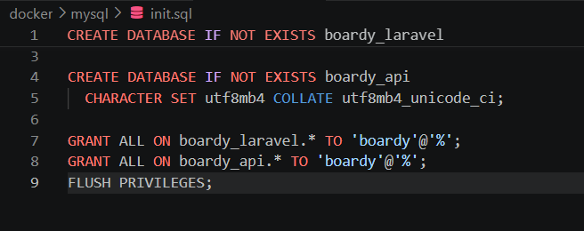

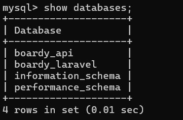

Официальный Docker-образ MySQL устроен так, что скрипты, расположенные разработчиком в директории `/docker-entrypoint-initdb.d/`, автоматически выполняются **только один раз — при самой первой инициализации контейнера**, когда примонтированный объем (`mysql_data`) абсолютно пуст.

Это сделано в целях безопасности и защиты данных: если бы скрипт выполнялся при каждом перезапуске контейнера, команда `CREATE DATABASE` или возможные очищающие инструкции затирали бы или повреждали уже существующие боевые данные пользователей. 

Если изменить содержимое файла `init.sql` после того, как база данных уже была успешно создана и инициализирована, эти изменения **будут полностью проигнорированы** при последующих запусках `docker compose up`. Чтобы заставить Docker применить обновленный `init.sql`, потребуется полностью сбросить состояние, уничтожив именованный volume с помощью команды `docker compose down -v`.

## Задание 13. Два .env файла

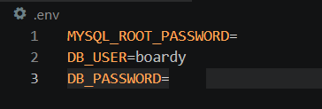

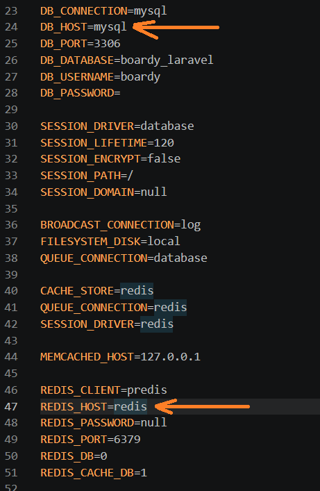

Разделение конфигурации на два независимых файла преследует разные цели обслуживания слоев:
1. **Корневой `.env`:** Предназначен строго для утилиты Docker Compose. Он конфигурирует параметры внешней инфраструктуры — root-пароли для разворачивания базы данных, порты, которые необходимо пробросить наружу на хост-машину, названия внутренних томов. К нему не имеет доступа код приложений.
2. **Внутренний `.env` (`boardy-laravel/.env`):** Предназначен исключительно для самого фреймворка Laravel, работающего внутри изолированного контейнера.

Внутренние параметры подключения кардинально отличаются от классических локальных настроек. Так как СУБД MySQL теперь изолирована в своем контейнере, адрес `127.0.0.1` указывать нельзя (для Laravel адрес `127.0.0.1` — это его собственный контейнер, где базы данных нет). Переменная `DB_HOST=mysql` указывает Laravel обращаться по DNS-имени к соседнему контейнеру в сети Docker, аналогично `REDIS_HOST=redis` перенаправляет запросы к контейнеру с кэшем.

---

# Часть Д. Запуск и проверка

## Задание 14. docker compose up

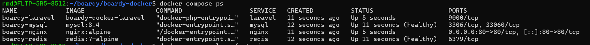

## Задание 15. Миграции в контейнере

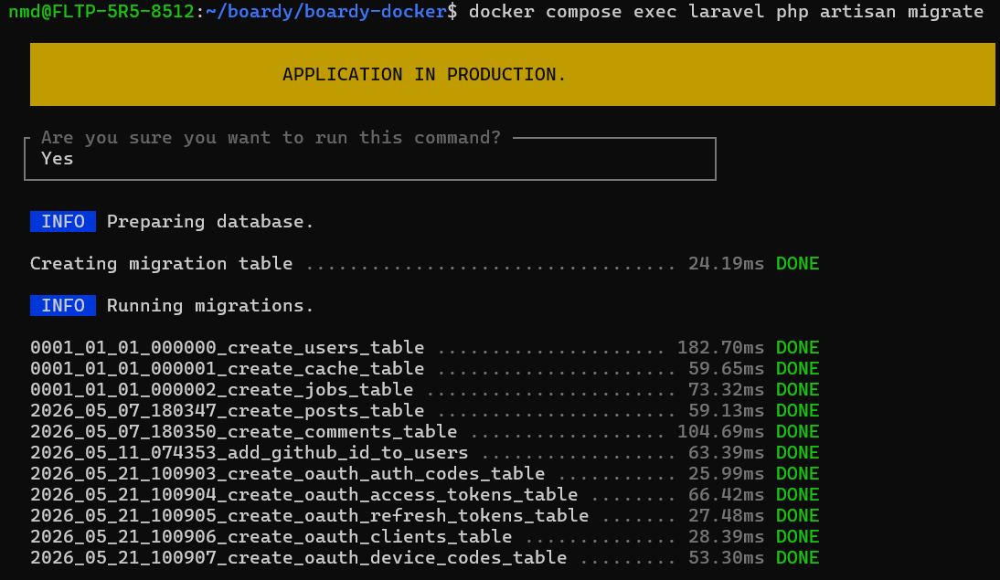

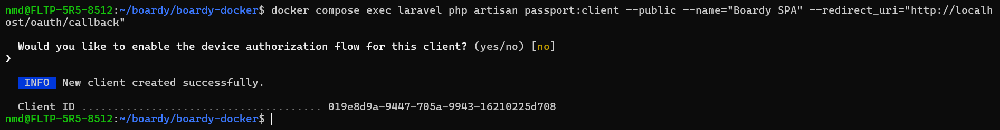

**Разница между командами `exec` и `run` в Docker Compose:**
* `docker compose exec`: Выполняет указанную команду внутри **уже существующего, запущенного в данный момент контейнера**. Она не создает новых сущностей, работает максимально быстро и использует текущее живое окружение. Именно её используют для наката миграций (`php artisan migrate`) на работающей системе.
* `docker compose run`: Создает **абсолютно новый, отдельный временный контейнер** из указанного в конфигурации образа, запускает его, выполняет переданную команду и останавливается. Данная команда используется для разовых изолированных административных задач, когда основная связка сервисов еще не запущена в фоне, однако она создает накладные расходы на запуск новой копии контейнера и требует ручной очистки (флаг `--rm`).

## Задание 16. Приложение работает

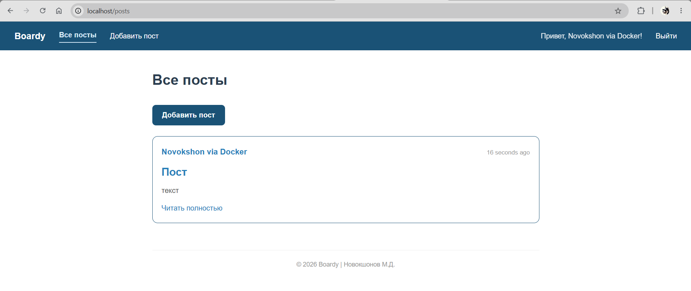

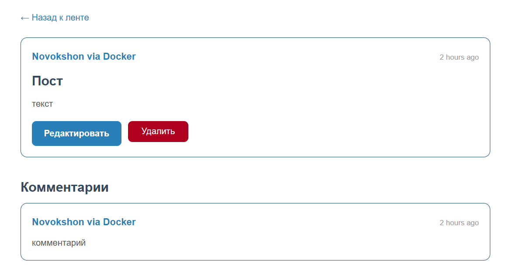

## Задание 17. Реалтайм работает

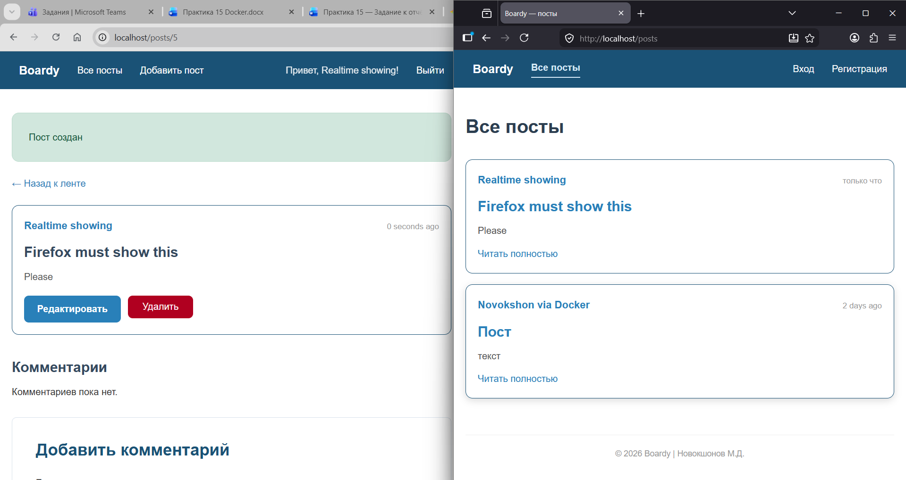

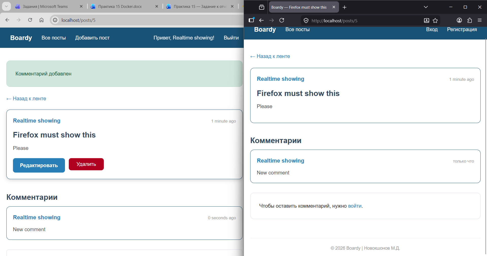

## Задание 18. Данные переживают перезапуск

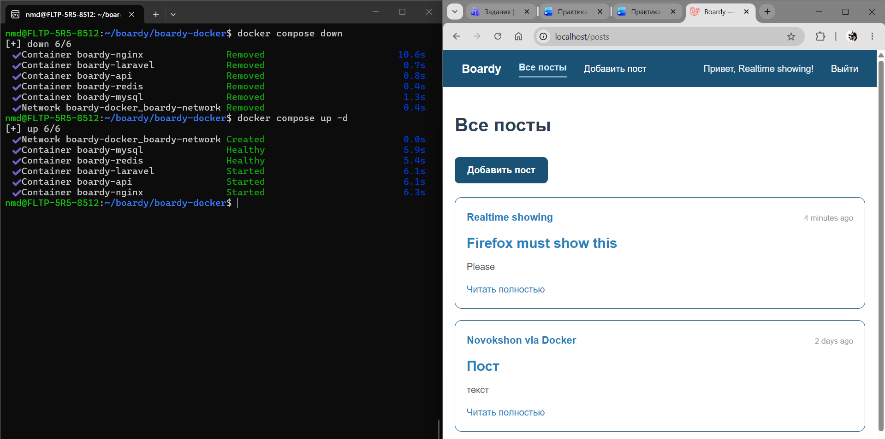

Если выполнить очищающую команду с флагом удаления томов:
```bash
docker compose down -v

```

Произойдет полное, безвозвратное уничтожение всех именованных объемов (`mysql_data`, `redis_data`, `laravel_storage`), прописанных в конфигурационном файле.

**Опасность флага `-v`:**
Данный флаг полностью стирает персистентное состояние проекта. Будут уничтожены все таблицы базы данных с реальной информацией пользователей, все загруженные файлы и аватары, история кэша. Использование этого флага на продуктовом сервере (production) является катастрофической ошибкой, ведущей к полной потере данных (data loss) при отсутствии внешних бэкапов. В локальной разработке флаг полезен исключительно для полной симуляции «чистой машины».

## Задание 19. Централизованные логи

Централизованное логирование средствами Docker (`docker compose logs`) обладает фундаментальными преимуществами перед классическим чтением файлов через `tail -f /var/log/*` на хост-машине:

1. **Единый временной поток (Aggregation):** Логи со всех 5 контейнеров поступают в один общий терминал в реальном времени, маркируясь разными цветами в зависимости от сервиса. Это позволяет наглядно отслеживать сквозные межсервисные цепочки вызовов: например, видно строку POST-запроса в `nginx`, тут же под ней строку обработки в `laravel` и следом отправленный асинхронный запрос в `fastapi`.
2. **Изоляция от операционной системы хоста:** Разработчику больше не требуется знать внутреннее устройство путей файловой системы каждого сервиса, настраивать конфигурационные файлы `logrotate` или выдавать права доступа к системным папкам `/var/log` на реальном сервере.
3. **Стандартизация вывода:** Все приложения в Docker настраиваются на отправку логов в стандартные потоки `stdout` и `stderr`. Это позволяет легко подключать внешние современные системы сбора и анализа логов (ELK-стек, Grafana Loki, Splunk) без изменения кода самих приложений при переносе на продакшен.

## Задание 20. Чистая машина

Благодаря полной контейнеризации Docker Compose, развертывание всего сложного стек-приложения (Nginx, PHP-FPM, FastAPI, MySQL, Redis) на любом новом компьютере или чистом сервере автоматизировано.

**Полная цепочка команд для запуска приложения на новой машине после клонирования репозитория:**

```bash
# 1. Переходим в склонированную папку проекта
cd boardy

# 2. Создаем файлы конфигурации окружения из подготовленных шаблонов
cp .env.example .env
cp boardy-laravel/.env.example boardy-laravel/.env

# 3. Собираем Docker-образы и поднимаем все 5 сервисов в фоновом режиме
docker compose up -d --build

# 4. Генерируем уникальный ключ безопасности приложения Laravel внутри контейнера
docker compose exec laravel php artisan key:generate

# 5. Запускаем миграции базы данных и наполняем её стартовыми тестовыми данными (seeds)
docker compose exec laravel php artisan migrate --seed

# 6. Генерируем персональные ключи шифрования для API-авторизации Laravel Passport
docker compose exec laravel php artisan passport:install

```

После выполнения этой последовательности команд приложение на чистой машине полностью готово к работе по адресу `http://localhost`.
