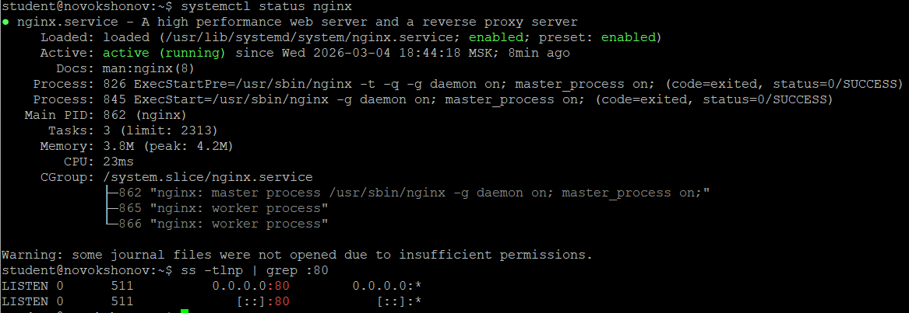
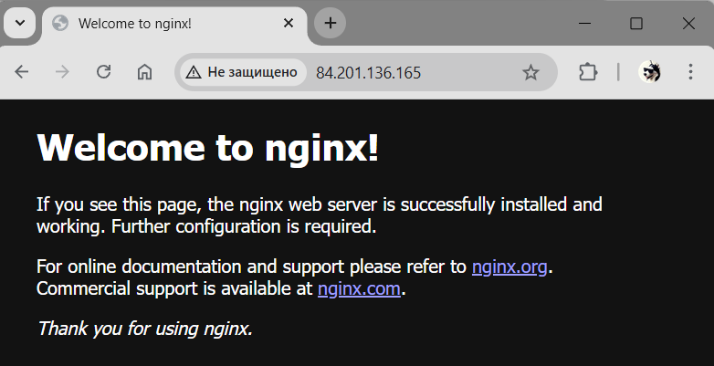
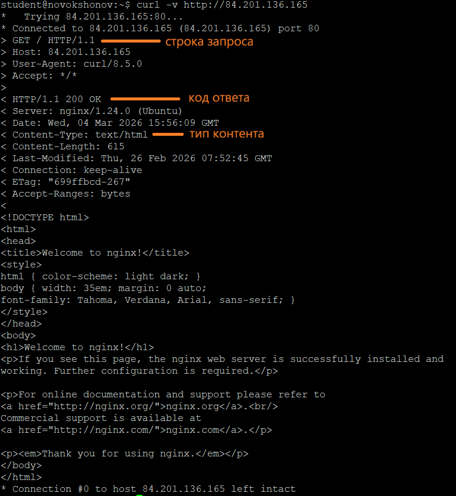
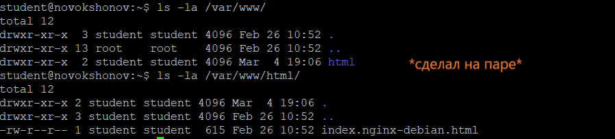
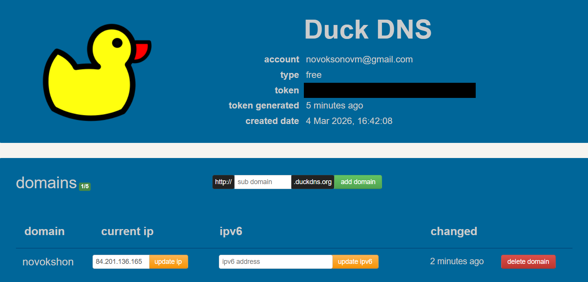
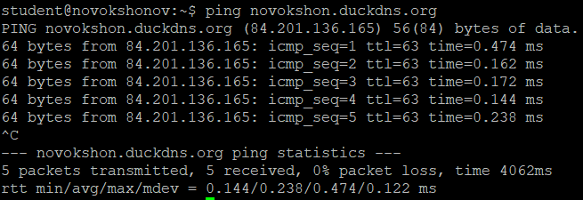
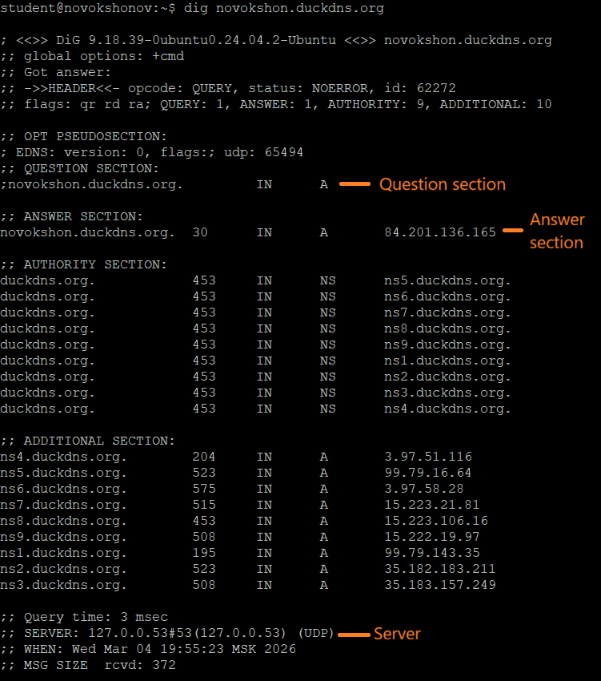
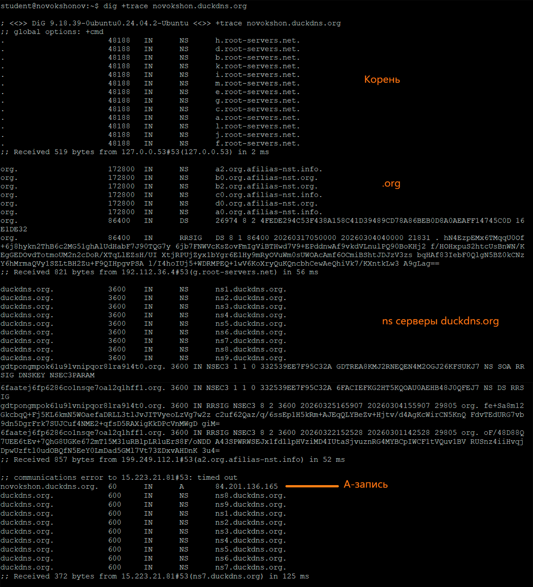
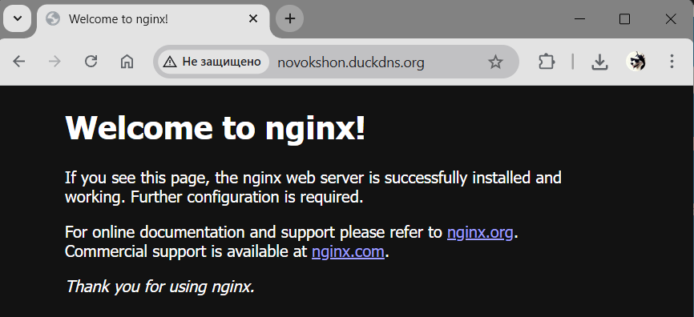

listen 80 default_server;
Директива listen указывает, на каком порту и интерфейсе сервер должен принимать входящие соединения; в данном случае Nginx слушает порт 80 на всех IPv4-интерфейсах и помечен как сервер по умолчанию.

listen [::]:80 default_server;
Директива listen указывает, что сервер также принимает соединения на порт 80 по протоколу IPv6 на всех интерфейсах и тоже является сервером по умолчанию для IPv6.

root /var/www/html;
Директива root задаёт корневую директорию, из которой Nginx будет брать файлы для обслуживания запросов (по умолчанию — /var/www/html).

server_name _;
Директива server_name определяет, для каких имён хостов (доменов) будет работать этот серверный блок; символ _ означает «любой домен / запрос без подходящего имени» (ловушка для всех остальных запросов).

index index.html index.htm index.nginx-debian.html;
Директива index задаёт список имён файлов, которые Nginx будет автоматически отдавать, если в запросе указана только директория (без имени файла), пробуя их по порядку.

В DuckDNS A-запись создаётся автоматически при обновлении IP

