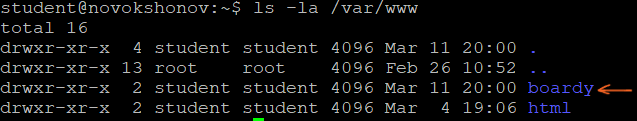

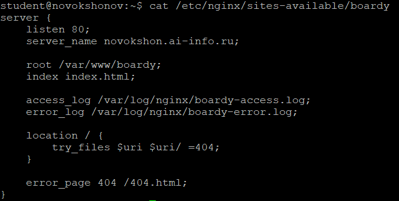

server_name — определяет домен(ы), для которого применяется этот серверный блок  
root — задаёт корневую директорию сайта  
access_log — путь к файлу лога доступа для этого виртуального хоста  
error_log — путь к файлу лога ошибок для этого виртуального хоста  
try_files — проверяет наличие файлов в указанном порядке, при отсутствии возвращает 404  
error_page — задаёт кастомную страницу для указанной ошибки (здесь 404)

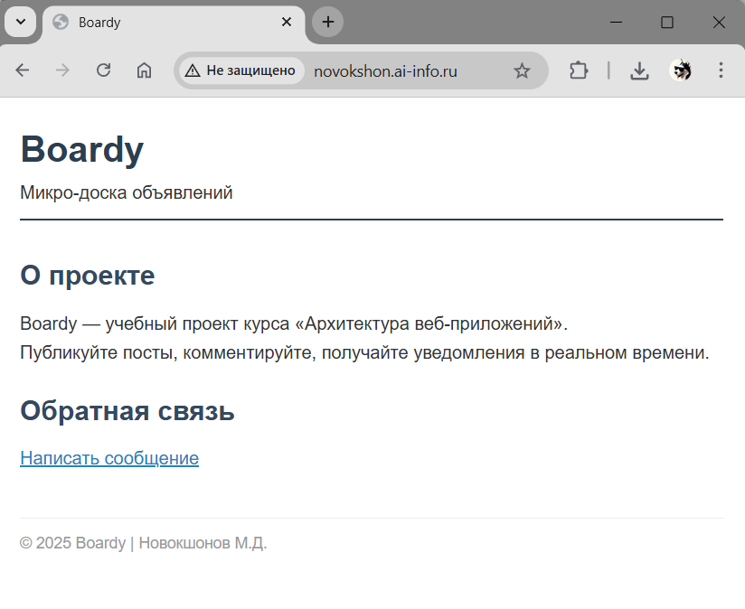

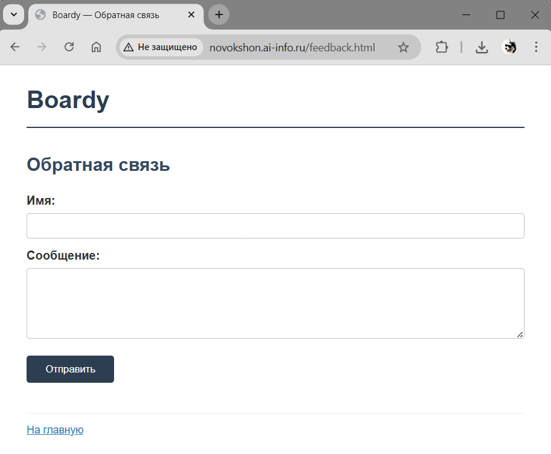

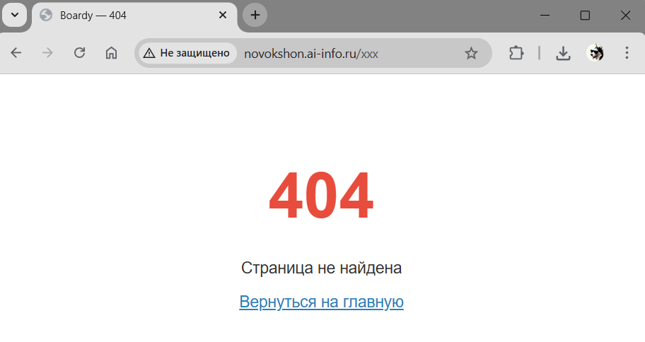

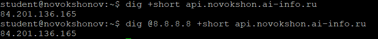

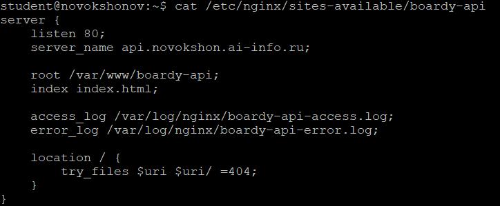

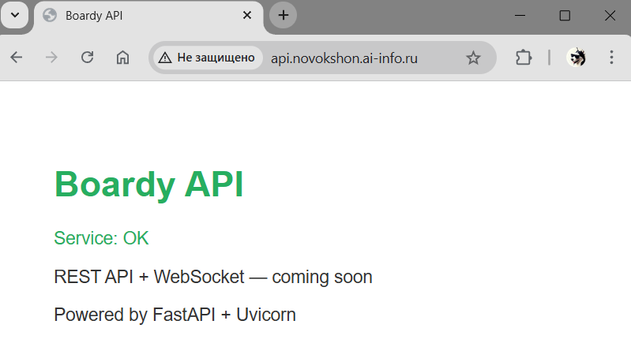

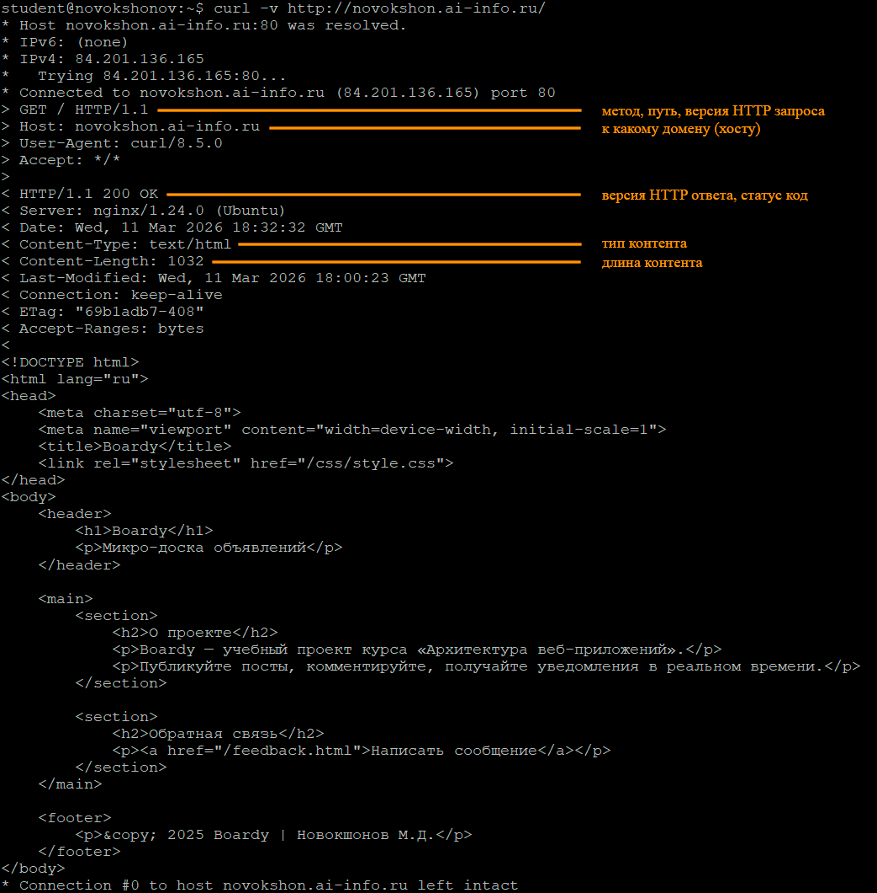

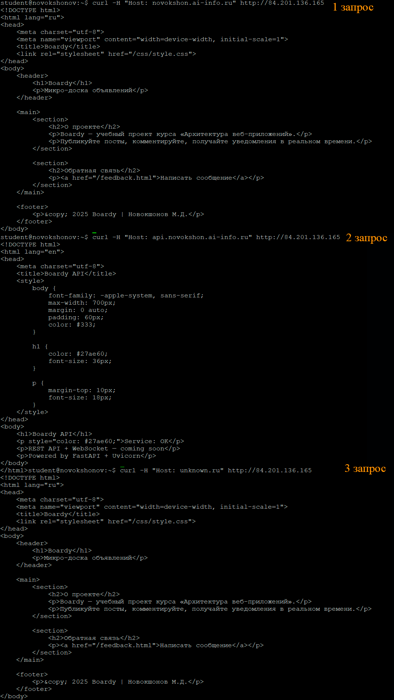

**Почему один IP возвращает разные страницы?**
Nginx выбирает серверный блок по заголовку Host из запроса, сравнивая его со значением server_name в конфиге.

**Что произошло с третьим запросом и почему?**
Nginx не нашёл server_name unknown.ru. Так как дефолтный конфиг удалён, а блок boardy оказался первым/единственным подходящим для нераспознанных хостов — запрос обработался как обычный к основному домену и вернулась главная страница Boardy.

**Почему Nginx не вернул 405?**
В конфигурации location / присутствует директива `try_files $uri $uri/ =404;`, которая проверяет существование файла или директории по пути запроса (/submit).  
Поскольку файла /submit или директории /submit/ не существует, Nginx считает ресурс несуществующим и отдаёт 404.  

Ожидаемый 405 Method Not Allowed возникает только тогда, когда путь считается существующим (файл/директория есть), но метод POST для статического контента запрещён.
В моей конфигурации try_files с явным =404 перехватывает ситуацию раньше, поэтому код ответа — 404.
Это поведение соответствует документации Nginx: try_files с =кодом в конце сразу возвращает указанный статус, если ничего не найдено.

**Чем отличается ответ на HEAD от GET?**
HEAD возвращает только заголовки ответа, без тела сообщения.  

**Зачем нужен HEAD?**
Для быстрой проверки существования ресурса, его размера, типа содержимого, даты изменения без загрузки всего файла (экономия трафика, используется в кэшировании, скриптах и т.д.).

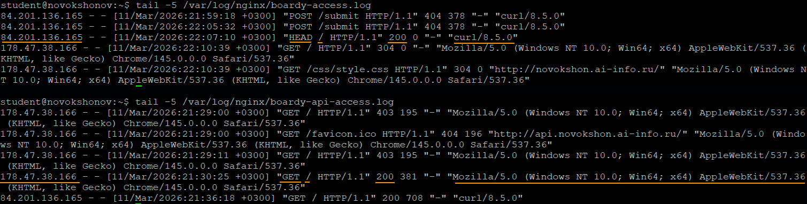

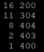

Смысла делать скриншот пулл реквеста, чтобы посмотреть его в том же пулл реквесте не вижу