# Часть A. HTTPS для основного сайта

## Задание 1. Установка certbot

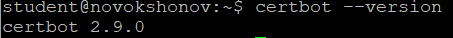

## Задание 2. Получение сертификата

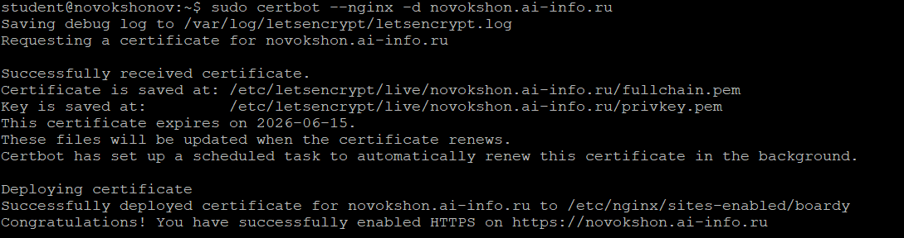

## Задание 3. Проверка в браузере

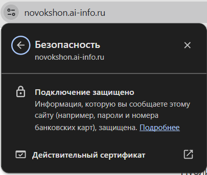

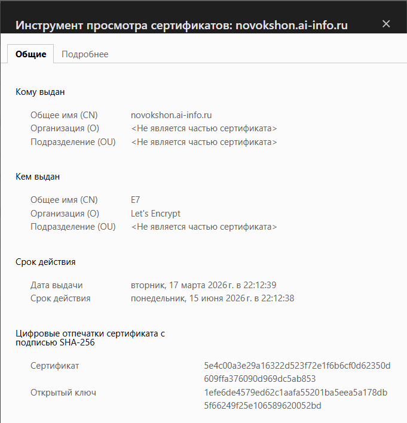

## Задание 4. Редирект

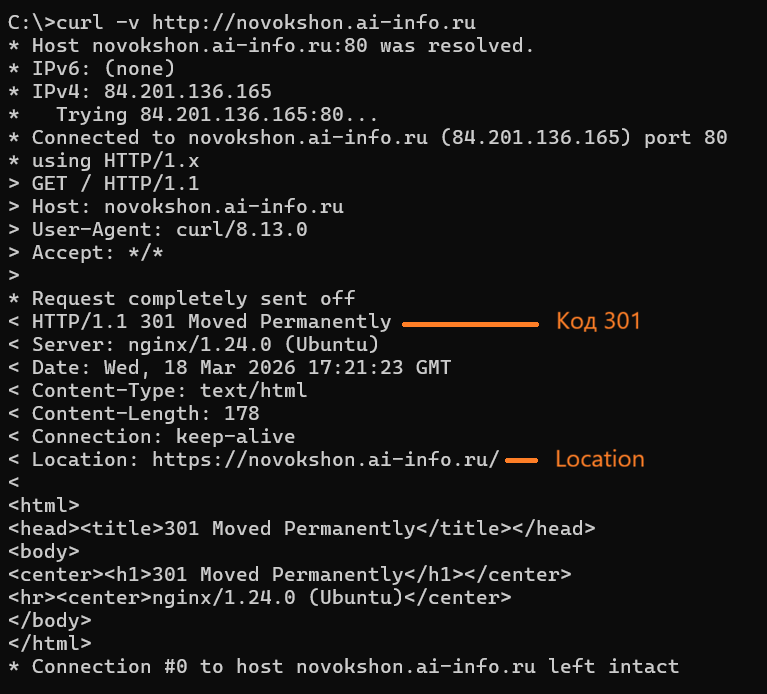

Сервер вернул код **301 Moved Permanently** и заголовок **Location: https://novokshon.ai-info.ru/**, указывающий на HTTPS-версию сайта.

## Задание 5. Конфиг после certbot

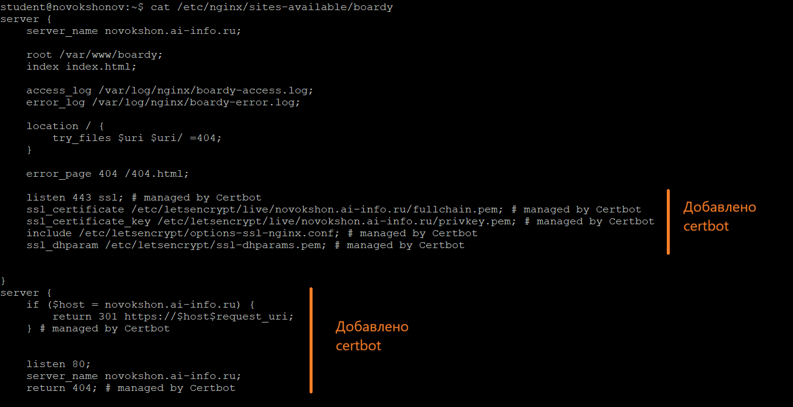

Certbot добавил следующие строки в серверный блок:
- `listen 443 ssl` — переключает nginx на приём HTTPS-соединений
- `ssl_certificate` — путь к полной цепочке сертификатов (fullchain.pem)
- `ssl_certificate_key` — путь к приватному ключу (privkey.pem)

Также добавлен отдельный серверный блок на порту 80, который редиректит все HTTP-запросы на HTTPS через код 301.

---

# Часть B. HTTPS для API-сервиса

## Задание 6. Сертификат для api-поддомена

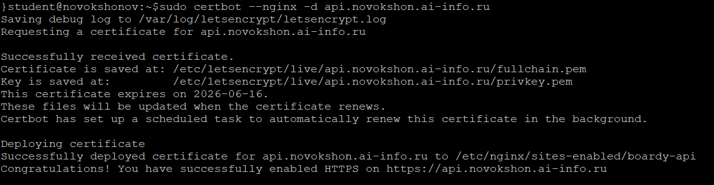

## Задание 7. Проверка обоих доменов

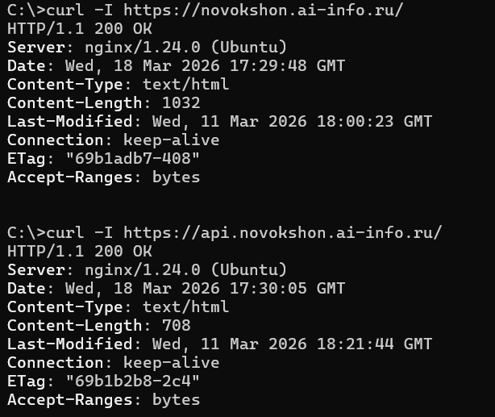

---

# Часть C. Разбор TLS

## Задание 8. TLS handshake

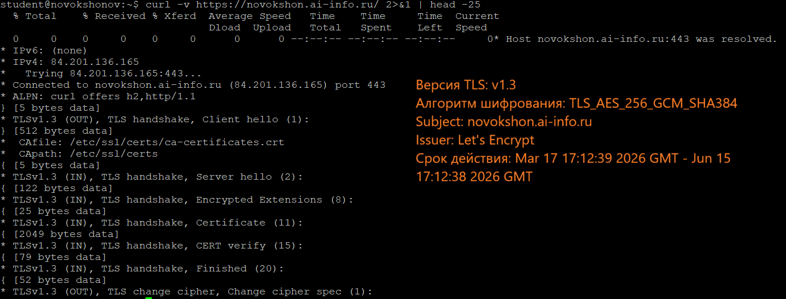

## Задание 9. Цепочка доверия

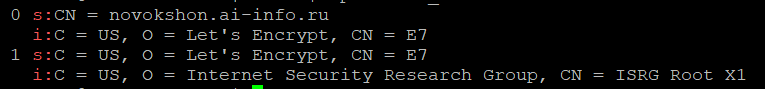

**Цепочка доверия:**

```
Корневой CA:       ISRG Root X1 (Internet Security Research Group)
       ↓
Промежуточный CA:  Let's Encrypt E7 (C=US, O=Let's Encrypt)
       ↓
Сертификат сайта:  novokshon.ai-info.ru
```

**Как браузер проверяет цепочку:**

1. Браузер получает сертификат сайта (`novokshon.ai-info.ru`) и видит, что он подписан промежуточным CA — `Let's Encrypt E7`
2. Браузер проверяет промежуточный сертификат (`Let's Encrypt E7`) и видит, что он подписан корневым CA — `ISRG Root X1`
3. Браузер ищет корневой сертификат (`ISRG Root X1`) в своём локальном хранилище доверенных корневых центров сертификации (встроено в ОС или браузер)
4. Если корневой CA найден и доверенный — вся цепочка считается валидной, браузер показывает замочек 🔒
5. Дополнительно браузер проверяет срок действия каждого сертификата, не отозван ли сертификат (через CRL или OCSP), и совпадает ли доменное имя с полем Subject

## Задание 10. Сравнение сертификатов

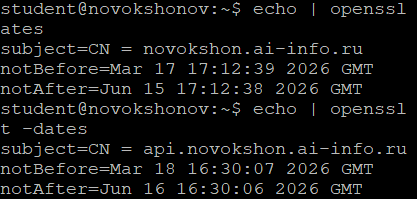

**Что общего:**
- Оба сертификата выданы одним удостоверяющим центром — Let's Encrypt
- Оба используют одинаковый алгоритм и срок действия 90 дней
- Оба обслуживаются на одном сервере

**Чем отличаются:**
- Subject: у первого `CN = novokshon.ai-info.ru`, у второго `CN = api.novokshon.ai-info.ru` — это разные сертификаты для разных доменов
- Даты выдачи и истечения немного отличаются, так как сертификаты получались в разное время

---

# Часть D. HSTS, кэширование, gzip

## Задание 11. HSTS

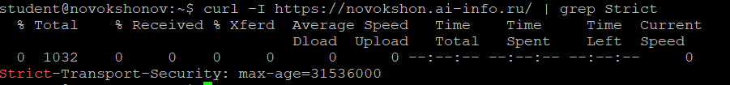

**Что такое HSTS и от чего защищает?**

HSTS (HTTP Strict Transport Security) — это механизм, при котором сервер сообщает браузеру, что данный сайт должен открываться исключительно по HTTPS. Браузер запоминает это указание на срок `max-age` (в данном случае 31536000 секунд = 1 год) и автоматически преобразует все HTTP-запросы к этому домену в HTTPS ещё до отправки на сервер. HSTS защищает от атак типа SSL stripping, при которых злоумышленник пытается понизить соединение с HTTPS до HTTP.

## Задание 12. Кэширование и gzip

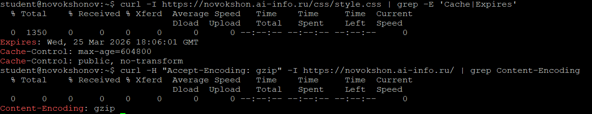

Для статических файлов (css, js, изображения) настроен заголовок `Cache-Control: max-age=604800` (7 дней), что позволяет браузеру кешировать их локально и не запрашивать повторно при каждом посещении. Gzip-сжатие подтверждается заголовком `Content-Encoding: gzip` в ответе сервера — это уменьшает объём передаваемых данных и ускоряет загрузку страниц.

## Задание 13. Автообновление

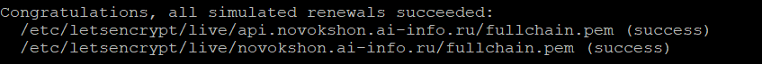

Certbot при установке автоматически создаёт задачу в cron (или systemd timer), которая дважды в день проверяет срок действия сертификатов и обновляет их при необходимости. Команда `--dry-run` симулирует обновление без реального выпуска нового сертификата — оба сертификата (основной и api) успешно прошли проверку.
