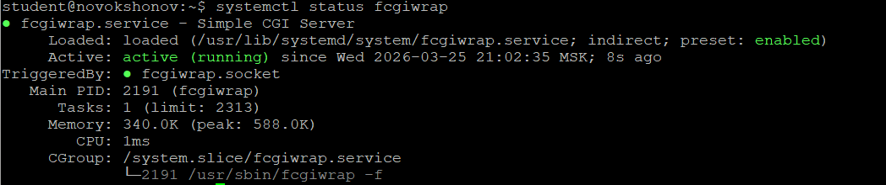
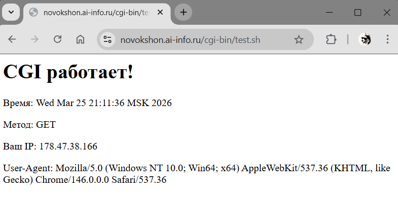
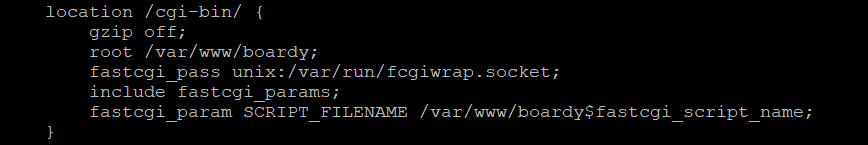
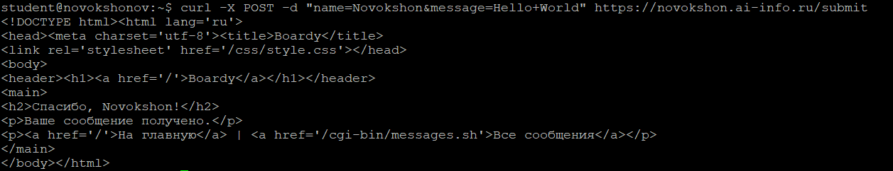
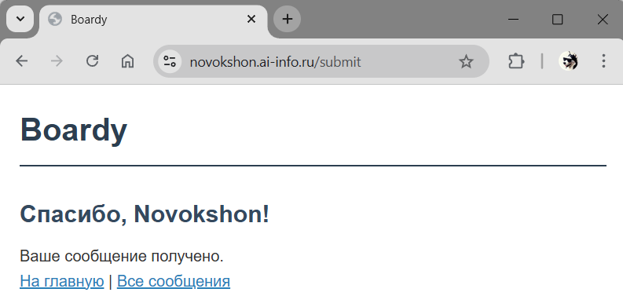
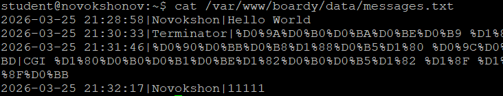
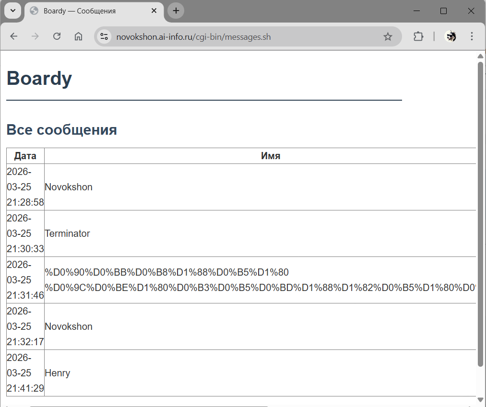
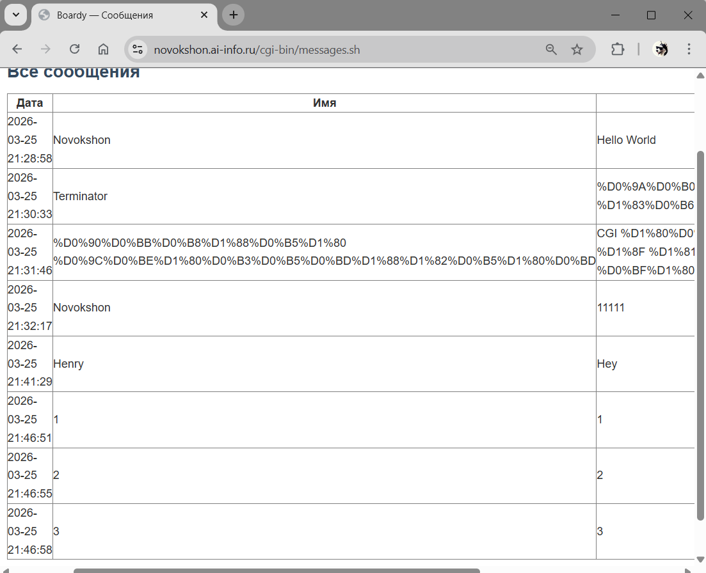

# Часть A. CGI-скрипт

## Задание 1. Установка fcgiwrap



## Задание 2. Тестовый скрипт



## Задание 3. Конфигурация Nginx



**Объяснение каждой строки блока `location /cgi-bin/`:**

- `gzip off` — отключает gzip-сжатие для CGI-ответов, так как скрипты сами формируют вывод и сжатие может нарушить заголовки
- `root /var/www/boardy` — корневая директория, относительно которой nginx ищет CGI-скрипты
- `fastcgi_pass unix:/var/run/fcgiwrap.socket` — передаёт запрос процессу fcgiwrap через Unix-сокет; fcgiwrap запускает CGI-скрипт и возвращает ответ
- `include fastcgi_params` — подключает стандартный набор переменных FastCGI (REQUEST_METHOD, QUERY_STRING, REMOTE_ADDR и др.), которые скрипт получает через переменные окружения
- `fastcgi_param SCRIPT_FILENAME /var/www/boardy$fastcgi_script_name` — указывает fcgiwrap полный путь к исполняемому скрипту на диске; без этого fcgiwrap не знает, какой файл запускать

---

# Часть B. Форма Boardy

## Задание 4. Скрипт обработки формы



## Задание 5. Форма в браузере



## Задание 6. Данные на диске



---

# Часть C. Страница сообщений

## Задание 7. Скрипт вывода сообщений



## Задание 8. Полный цикл



---

# Часть D. Анализ

## Задание 9. Путь запроса

Схема пути POST-запроса от формы до записи в файл:

```
Браузер
  │  (заполняет форму, нажимает Submit)
  │  POST /submit  (HTTPS, порт 443)
  ▼
Nginx
  │  (принимает запрос, видит location /submit → fastcgi_pass)
  │  FastCGI-протокол через Unix-сокет
  ▼
fcgiwrap
  │  (получает FastCGI-запрос, запускает скрипт как дочерний процесс)
  │  fork/exec
  ▼
submit.sh
  │  (читает тело запроса из stdin: name=...&message=...)
  │  (парсит параметры, формирует строку с датой)
  ▼
messages.txt
  │  (строка записывается в файл на диске)
  │
  ▼
submit.sh → stdout
  │  (генерирует HTML-ответ «Спасибо, {имя}!»)
  ▼
fcgiwrap → Nginx
  │  (передаёт HTTP-ответ обратно через FastCGI-сокет)
  ▼
Браузер
     (отображает страницу благодарности)
```

## Задание 10. Теоретические вопросы

**1. Что такое CGI и какую проблему он решил в 1993 году?**

CGI (Common Gateway Interface) — стандартный интерфейс, позволяющий веб-серверу запускать внешние программы и передавать их вывод клиенту в качестве HTTP-ответа. До его появления веб-серверы умели отдавать только статические файлы; CGI решил проблему генерации динамического содержимого — ответ стало можно формировать программой, которая, например, читает базу данных или обрабатывает данные формы.

**2. Как CGI-скрипт получает данные POST-запроса?**

Тело POST-запроса nginx передаёт скрипту через стандартный ввод (stdin). Длина тела указывается в переменной окружения `CONTENT_LENGTH`, а тип содержимого — в `CONTENT_TYPE`. Скрипт читает ровно столько байт из stdin, сколько указано в `CONTENT_LENGTH`, и затем сам разбирает строку вида `name=value&key=value`.

**3. Почему CGI создаёт проблемы при высокой нагрузке?**

При каждом входящем запросе сервер создаёт новый процесс для запуска скрипта и уничтожает его после ответа. Создание процесса — дорогостоящая операция, поэтому при большом числе одновременных запросов сервер тратит значительные ресурсы CPU и памяти на постоянные fork/exec, что быстро приводит к деградации производительности.

**4. Чем отличается `fastcgi_pass` от `proxy_pass`?**

`proxy_pass` передаёт запрос другому HTTP-серверу по протоколу HTTP — nginx выступает как обратный прокси. `fastcgi_pass` использует протокол FastCGI — более лёгкий бинарный протокол, специально разработанный для взаимодействия веб-сервера с приложениями; при этом nginx самостоятельно формирует FastCGI-переменные окружения (SCRIPT_FILENAME, REQUEST_METHOD и др.) и не ожидает на другом конце полноценный HTTP-сервер.

**5. Зачем нужен fcgiwrap, если Apache запускает CGI напрямую?**

Apache имеет встроенный модуль `mod_cgi`, который умеет напрямую fork'ать и запускать CGI-скрипты. Nginx намеренно лишён этой возможности — он работает только по протоколу FastCGI. fcgiwrap служит прослойкой: принимает FastCGI-запросы от nginx через Unix-сокет и запускает обычные CGI-скрипты, транслируя между двумя протоколами. Это позволяет использовать существующие CGI-скрипты вместе с nginx без их переписывания.
