# Часть A. PHP-FPM

## Задание 1. Установка PHP-FPM

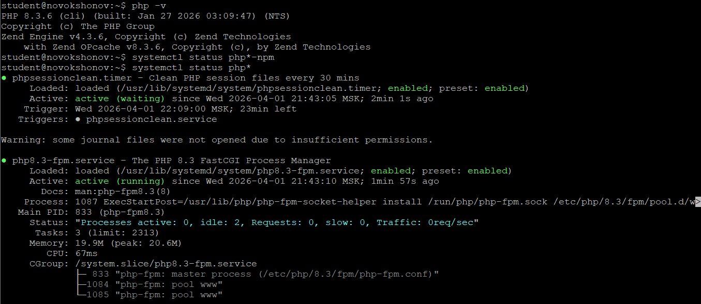

## Задание 2. Форма и сообщения на PHP

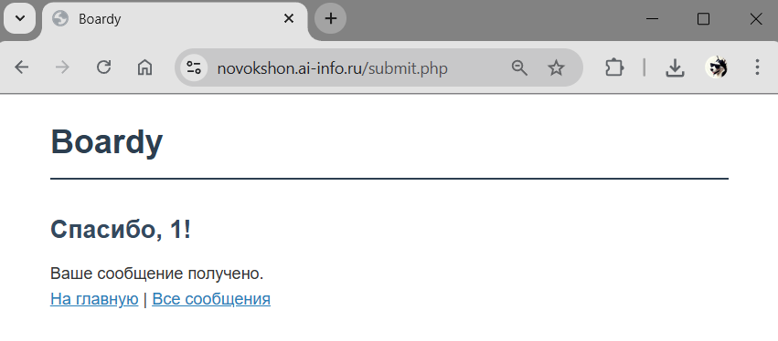

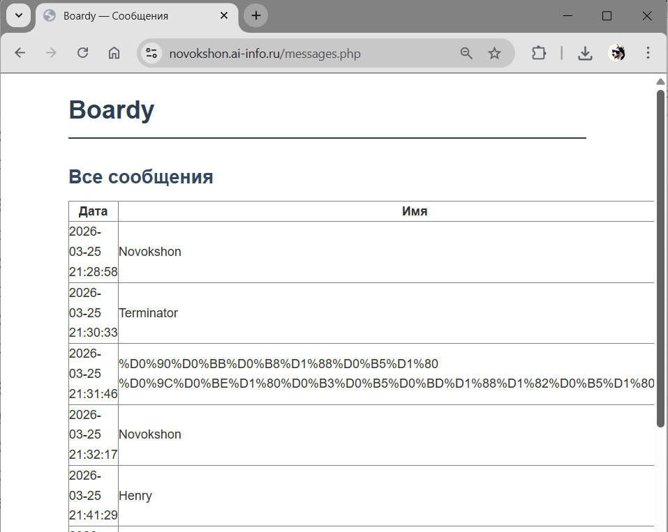

## Задание 3. Конфиг Nginx для PHP

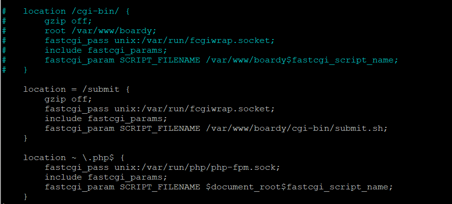

**Чем fastcgi_pass для PHP-FPM отличается от CGI через fcgiwrap? Почему PHP-FPM быстрее?**

При использовании CGI через fcgiwrap каждый запрос порождает новый процесс: nginx передаёт запрос fcgiwrap, тот делает fork и exec скрипта, а после ответа процесс уничтожается. Это дорого по ресурсам.

PHP-FPM (FastCGI Process Manager) работает иначе: при старте он создаёт пул воркеров, которые остаются живыми и ждут запросов. Nginx передаёт запрос напрямую одному из воркеров через FastCGI-сокет — без fork/exec. PHP-среда уже инициализирована, opcache прогрет, поэтому обработка начинается немедленно. Именно отсутствие накладных расходов на создание процесса при каждом запросе делает PHP-FPM значительно быстрее.

## Задание 4. Shared nothing

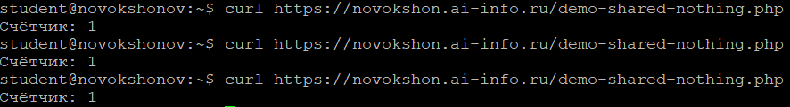

**Почему счётчик не растёт? Что такое shared nothing?**

Счётчик объявлен как обычная PHP-переменная в теле скрипта. При каждом HTTP-запросе PHP-FPM запускает скрипт заново в изолированном контексте: переменные инициализируются с нуля, а по завершении запроса уничтожаются. Никакого общего состояния между запросами не существует — даже если их обрабатывает один и тот же воркер.

Это и есть принцип **shared nothing** («ничего общего»): каждый запрос полностью независим, не имеет доступа к памяти предыдущего и не оставляет после себя ничего следующему. Архитектура упрощает горизонтальное масштабирование (любой сервер может обработать любой запрос), но требует хранить состояние во внешних хранилищах — базе данных, Redis, файловой системе.

## Задание 5. Блокировка воркеров

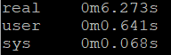

**Сколько заняло? Сколько воркеров у PHP-FPM? Как связаны эти числа?**

Выполнение 10 параллельных запросов заняло ~6.3 секунды. PHP-FPM в конфигурации по умолчанию запускает 2 воркера (видно в выводе `systemctl status`: `idle: 2`). Каждый воркер однопоточный и может обрабатывать только один запрос одновременно, блокируясь на `sleep(2)`.

Связь прямая: 10 запросов при 2 воркерах обрабатываются по 2 за раз. Математически это 5 волн × 2 сек = 10 секунд, но благодаря асинхронному запуску в фоне (`&`) первые запросы успевают стартовать до завершения предыдущих, что даёт итоговое время ~6 сек вместо 10. Чем меньше воркеров, тем дольше очередь ждёт при нагрузке.

---

# Часть B. FastAPI

## Задание 6. Установка и приложение

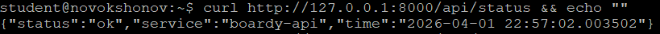

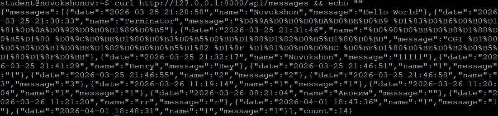

## Задание 7. Живой процесс (счётчик)

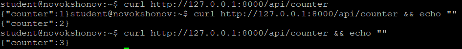

**Почему здесь счётчик растёт, а в PHP не рос?**

FastAPI работает как единый долгоживущий процесс Uvicorn. Глобальная переменная-счётчик объявлена один раз при старте приложения и остаётся в памяти процесса между запросами. Каждый запрос к `/api/counter` обращается к той же переменной и инкрементирует её.

В PHP ситуация противоположная: принцип shared nothing гарантирует, что никакое состояние не переживает один HTTP-запрос. В FastAPI же процесс живёт непрерывно — это осознанное архитектурное решение, и именно поэтому для хранения такого состояния в многопроцессной среде нужен внешний кэш (Redis и т.п.).

## Задание 8. Async: 10 запросов за 2 секунды

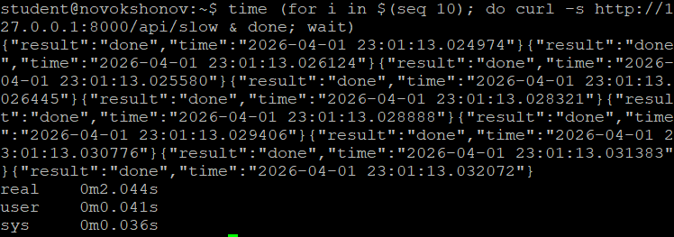

**Почему 10 запросов по 2 секунды заняли ~2, а не 20 секунд?**

Эндпоинт `/api/slow` использует `await asyncio.sleep(2)` — асинхронное ожидание. Когда один запрос «засыпает», он не блокирует поток: event loop переключается на следующий запрос. В результате все 10 запросов ожидают одновременно, и итоговое время равно времени одного запроса — ~2 секунды. Это ключевое преимущество асинхронной модели: конкурентность без создания дополнительных потоков или процессов.

## Задание 9. Блокирующий код убивает event loop

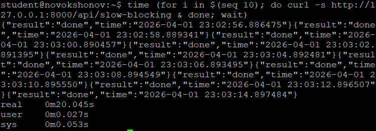

**Чем /api/slow отличается от /api/slow-blocking? Почему время разное?**

`/api/slow` использует `await asyncio.sleep(2)` — асинхронную операцию, которая не занимает поток во время ожидания, позволяя event loop обрабатывать другие запросы параллельно.

`/api/slow-blocking` использует `time.sleep(2)` — синхронный вызов, который **блокирует единственный поток** event loop целиком. Пока один запрос спит, все остальные ждут в очереди. Поэтому 5 запросов выполняются строго последовательно: 5 × 2 = ~10 секунд. Это классическая ошибка при написании async-кода: любой блокирующий вызов (I/O, тяжёлые вычисления) в корутине уничтожает всё преимущество асинхронности.

## Задание 10. Swagger

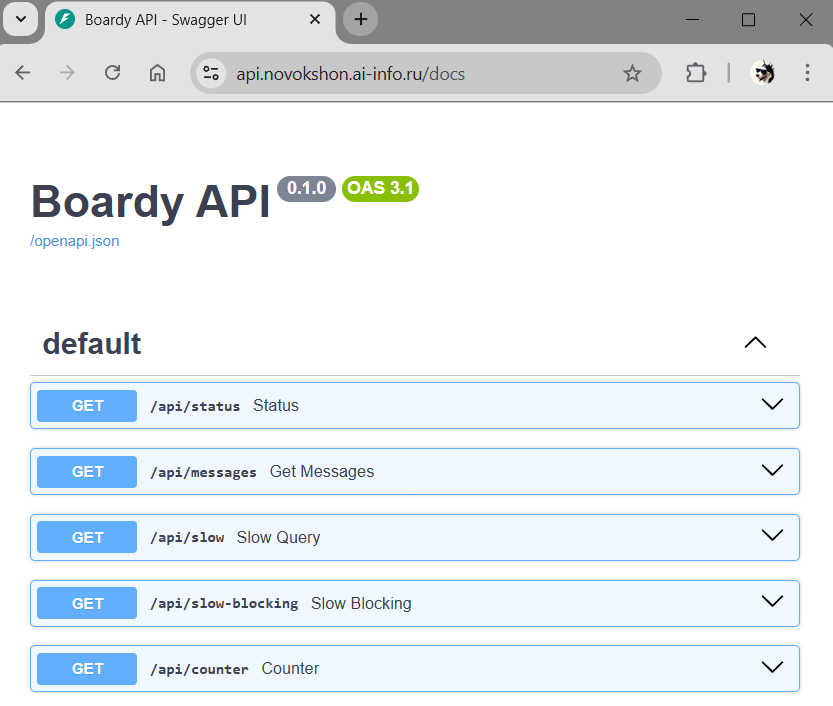

## Задание 11. systemd-сервис

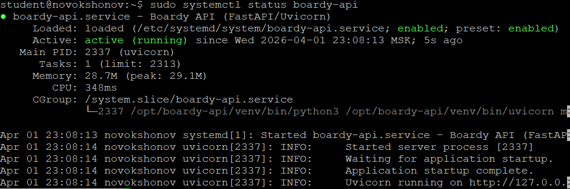

## Задание 12. Nginx proxy_pass

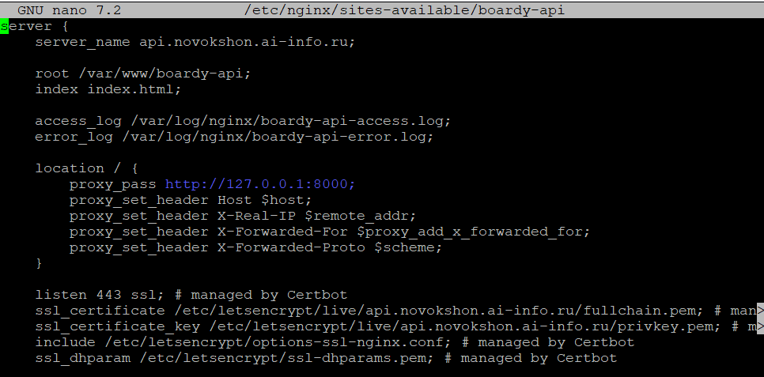

**Чем proxy_pass отличается от fastcgi_pass? Почему для PHP одно, для Python другое?**

`fastcgi_pass` используется, когда приложение на другом конце «говорит» на протоколе FastCGI — бинарном протоколе для запуска скриптов. Nginx при этом сам формирует переменные окружения (SCRIPT_FILENAME, REQUEST_METHOD и т.д.) и передаёт тело запроса через этот протокол. PHP-FPM реализует именно FastCGI-сервер, поэтому для него используется `fastcgi_pass`.

`proxy_pass` используется, когда приложение на другом конце — полноценный HTTP-сервер. Nginx просто пересылает HTTP-запрос как есть, выступая обратным прокси. Uvicorn запускает стандартный ASGI/HTTP-сервер на порту 8000, поэтому для FastAPI используется `proxy_pass`. Python-фреймворки не реализуют FastCGI — они поднимают собственный HTTP-сервер.

---

# Часть C. Сравнение

## Задание 13. Два формата

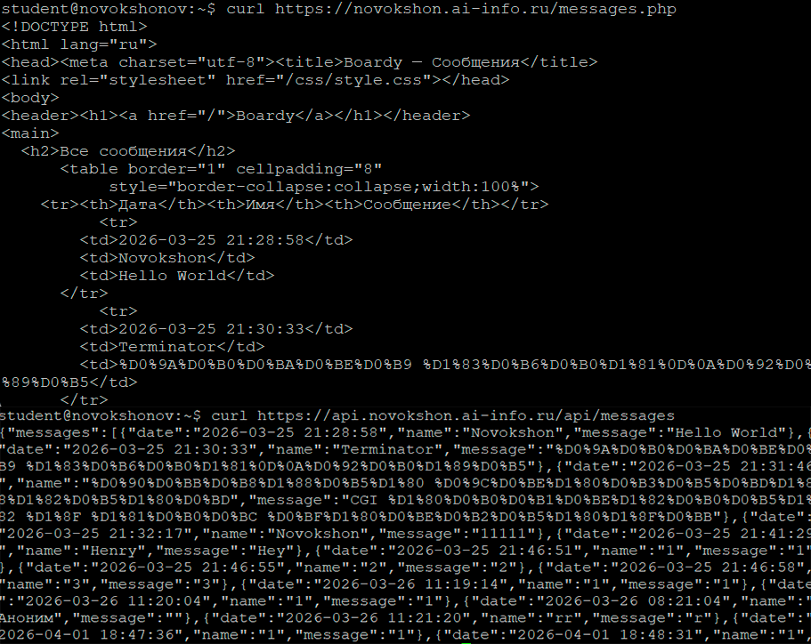

**Одни данные, два формата. Чем отличаются? Для кого каждый?**

`messages.php` возвращает **HTML** — готовую страницу с таблицей, стилями и разметкой, предназначенную для непосредственного отображения в браузере. Это формат для конечного пользователя: он видит красиво оформленный контент, но машине разобрать структуру данных из HTML сложно.

`/api/messages` возвращает **JSON** — структурированные данные без оформления, предназначенные для программной обработки. Это формат для других приложений и разработчиков: мобильные приложения, фронтенд на JavaScript, сторонние сервисы могут легко распарсить JSON и использовать данные по своему усмотрению. Один бэкенд с JSON API может обслуживать браузер, мобильное приложение и внешние интеграции одновременно.

## Задание 14. Процессы

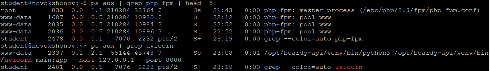

Вывод `ps aux` наглядно показывает архитектурное различие двух подходов: PHP-FPM запускает **несколько процессов** (master + несколько воркеров пула `www`), каждый из которых может обработать один запрос одновременно. Uvicorn же работает как **один процесс**, который благодаря event loop обрабатывает множество запросов конкурентно внутри одного потока.
