# Часть A. MySQL — установка и настройка

## Задание 1. Установка MySQL

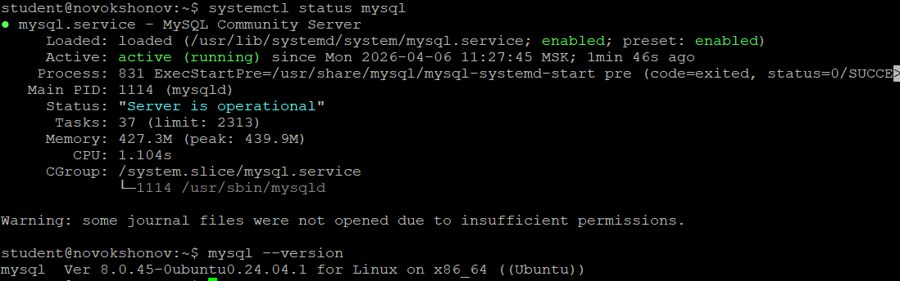

## Задание 2. База данных и пользователь

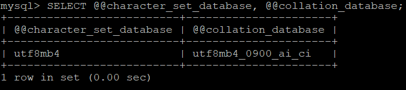

**Почему utf8mb4, а не utf8?**

В MySQL тип `utf8` — это исторически урезанная реализация, поддерживающая только символы до 3 байт. Это означает, что символы за пределами базовой многоязычной плоскости Unicode (эмодзи, некоторые иероглифы CJK) в такой колонке просто не сохранятся. `utf8mb4` — настоящая полная реализация UTF-8, поддерживающая все 4-байтные символы. Для любого современного приложения следует использовать именно `utf8mb4`.

**Что такое collation и зачем unicode_ci?**

Collation — это правило сравнения и сортировки строк. Оно определяет, например, считать ли `А` и `а` одинаковыми при поиске, и как сортировать кириллицу. Суффикс `_ci` означает case-insensitive (без учёта регистра) — запрос `WHERE name = 'иванов'` найдёт и «Иванов», и «ИВАНОВ». `unicode_ci` использует стандартные правила сортировки Unicode, корректно обрабатывая все языки.

## Задание 3. phpMyAdmin

---

# Часть B. Таблицы и связи

## Задание 4. Три таблицы

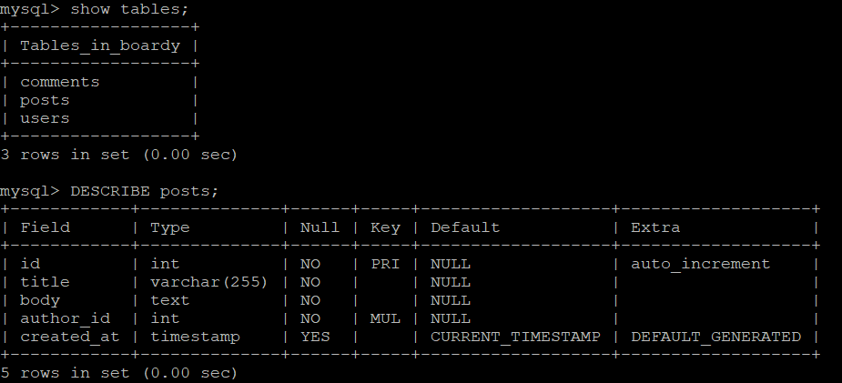

**Что такое FOREIGN KEY и ON DELETE CASCADE? Зачем?**

`FOREIGN KEY` — ограничение целостности, которое гарантирует, что значение в колонке одной таблицы обязательно существует как первичный ключ в другой. Например, `author_id` в `posts` обязан ссылаться на реально существующего пользователя в `users`. Без этого ограничения в базе могут появиться «висячие» записи — посты без автора.

`ON DELETE CASCADE` определяет поведение при удалении родительской записи: все связанные дочерние записи удаляются автоматически. Удалили пользователя — все его посты и комментарии исчезают сами, без дополнительных запросов. Это удобно и защищает от мусора в базе.

**Какой движок используется и почему?**

Используется `InnoDB`. Это единственный движок MySQL, поддерживающий внешние ключи (`FOREIGN KEY`), транзакции и row-level блокировки. Альтернатива — `MyISAM` — не поддерживает FK и транзакции, поэтому для приложений с реляционными данными InnoDB является стандартом.

## Задание 5. SQL-скрипт

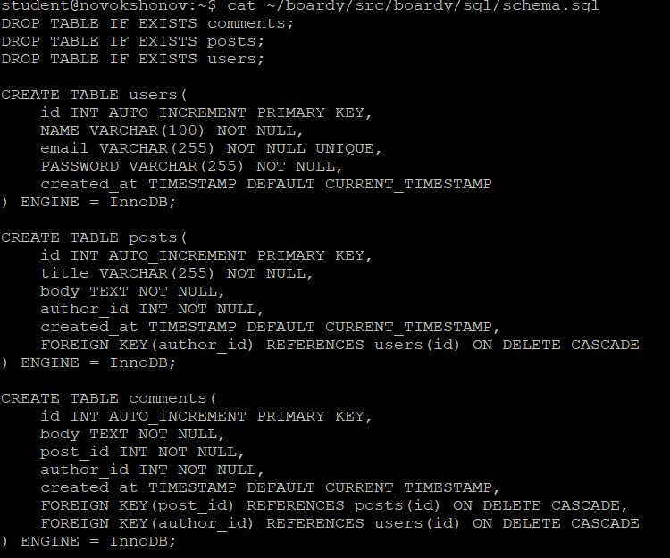

---

# Часть C. SQL — базовые операции

## Задание 6. INSERT

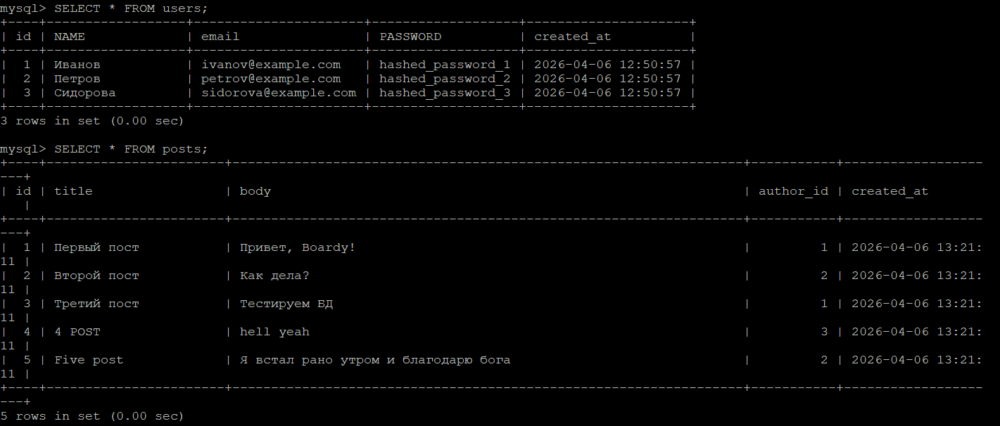

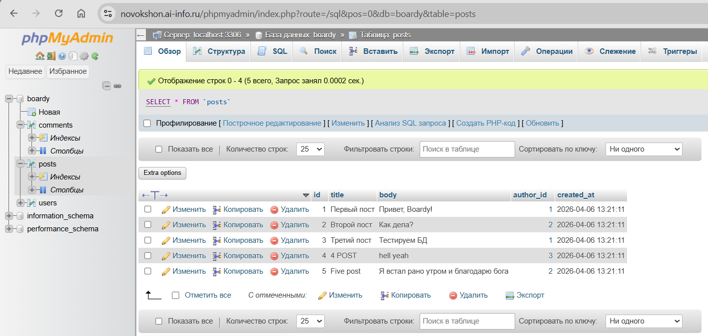

## Задание 7. SELECT + JOIN

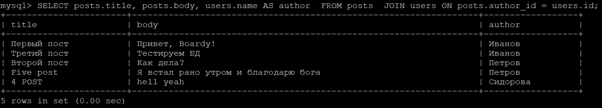

**Зачем JOIN? Как получить имя автора без него?**

Данные нормализованы: имя автора хранится в таблице `users`, а пост — в `posts`. В `posts` есть только `author_id` — числовой идентификатор. `JOIN` позволяет объединить две таблицы по этому ключу и получить имя автора прямо в одном запросе.

Без `JOIN` пришлось бы делать два отдельных запроса: сначала `SELECT * FROM posts`, затем для каждого поста отдельно `SELECT name FROM users WHERE id = ?`. Это называется «проблема N+1»: при 100 постах — 101 запрос к базе вместо одного. `JOIN` решает это одним запросом на уровне СУБД, что значительно эффективнее.

## Задание 8. Foreign Key — защита целостности

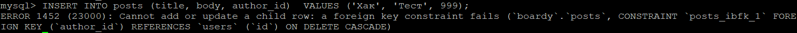

## Задание 9. CASCADE

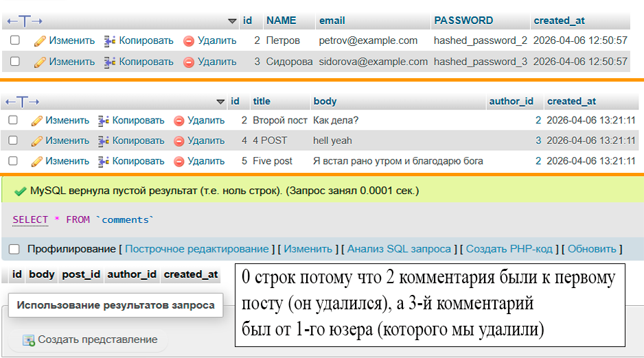

## Задание 10. SQL-инъекция

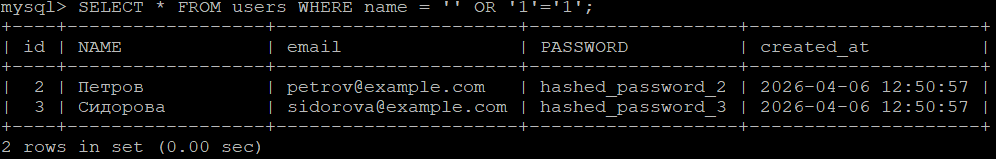

**Как работает SQL-инъекция? Как prepared statement защищает?**

SQL-инъекция происходит, когда пользовательские данные напрямую вставляются в строку SQL-запроса. Условие `WHERE name = '' OR '1'='1'` всегда истинно (`'1'='1'` никогда не бывает ложным), поэтому MySQL возвращает все строки таблицы — фильтрация полностью обходится. Атакующий может таким образом получить все данные, обойти авторизацию или удалить таблицы.

Prepared statement (параметризованный запрос) защищает иначе: SQL-шаблон (`WHERE name = ?`) компилируется отдельно от данных. Когда подставляется значение, MySQL воспринимает его строго как строку-данные, а не как часть SQL. Даже если пользователь введёт `' OR '1'='1`, это будет искаться буквально как имя, а не как SQL-код.

---

# Часть D. PHP + MySQL

## Задание 11. db.php

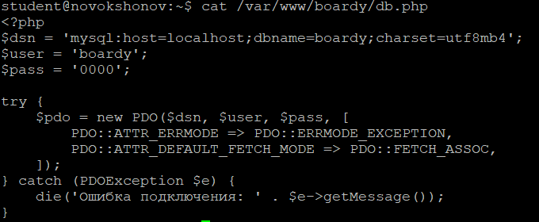

## Задание 12. submit.php через MySQL

## Задание 13. messages.php через MySQL

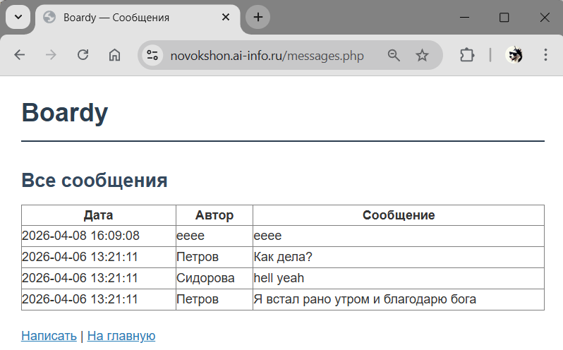

---

# Часть E. FastAPI + MySQL

## Задание 14. aiomysql

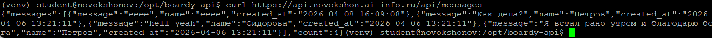

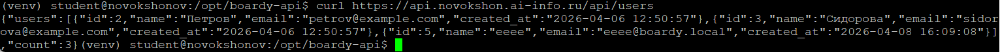

**Почему aiomysql, а не обычный mysql-connector? Что будет с event loop при синхронном драйвере?**

FastAPI работает на асинхронном event loop (asyncio). Обычный `mysql-connector` или `PyMySQL` — синхронные библиотеки: во время выполнения запроса к базе они блокируют вызывающий поток целиком. Это означает, что пока один запрос ждёт ответа от MySQL, event loop заморожен и не может обрабатывать другие входящие запросы — ровно та же проблема, что и с `time.sleep()` вместо `asyncio.sleep()` из предыдущей лабы.

`aiomysql` реализует асинхронный драйвер: запрос к базе выполняется через `await`, и пока MySQL думает, event loop спокойно обслуживает другие соединения. Это сохраняет всё преимущество асинхронной модели FastAPI при работе с базой данных.
