# Часть A. REST API

## Задание 1. Структура проекта

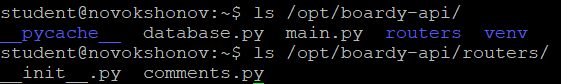

## Задание 2. GET — список комментариев

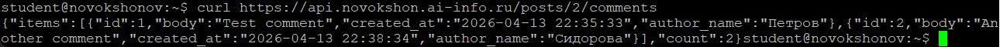

**Какой SQL-запрос выполняет этот эндпоинт? Зачем JOIN?**

Эндпоинт выполняет следующий запрос:
```sql
SELECT c.id, c.body, c.created_at, u.name AS author_name
FROM comments c
JOIN users u ON c.author_id = u.id
WHERE c.post_id = %s
ORDER BY c.created_at
```

JOIN нужен потому что данные нормализованы: в таблице `comments` хранится только `author_id` — числовой идентификатор. Имя автора живёт в таблице `users`. JOIN объединяет две таблицы по этому ключу и позволяет получить имя прямо в одном запросе, не делая отдельный SELECT для каждого комментария.

## Задание 3. POST — создать комментарий

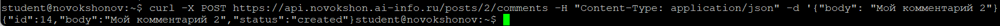

**Почему 201, а не 200? Что означает Content-Type: application/json?**

`200 OK` означает «запрос выполнен успешно» в общем смысле. `201 Created` — более точный код: он говорит что в результате запроса был создан новый ресурс. Это семантически правильнее для POST-запросов, создающих данные — клиент сразу понимает, что произошло именно создание, а не просто успешная операция.

`Content-Type: application/json` — заголовок, который сообщает серверу формат тела запроса. Без него сервер не знает как интерпретировать байты в теле — как JSON, как форму, как XML. FastAPI читает тело и десериализует его в Pydantic-модель именно благодаря этому заголовку.

## Задание 4. PUT — редактировать

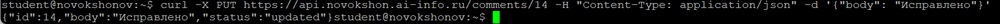

**Чем PUT отличается от POST? Почему URL другой?**

`POST` создаёт новый ресурс — ID ещё не известен, поэтому URL указывает на коллекцию (`/posts/2/comments`). `PUT` обновляет конкретный существующий ресурс — ID уже известен, поэтому URL указывает прямо на него (`/comments/14`).

URL `/comments/{id}` вместо `/posts/{id}/comments/{id}` — осознанное решение: комментарий идентифицируется своим собственным ID, и для его редактирования не нужен контекст поста. Это делает API чище и проще для клиента.

## Задание 5. DELETE — удалить

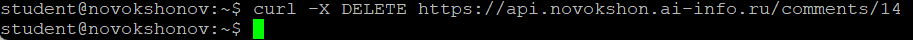

**4 HTTP-глагола и коды ответов:**

Глагол - Код - Почему
GET - 200 OK - Данные получены и возвращены в теле
POST - 201 Created - Новый ресурс создан
PUT - 200 OK - Ресурс обновлён, возвращаем обновлённые данные
DELETE - 204 No Content - Выполнено успешно, но возвращать нечего — ресурс удалён

## Задание 6. Ошибки

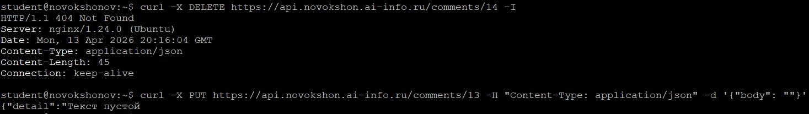

**Чем 404 отличается от 422?**

`404 Not Found` — ресурс не существует. Запрос синтаксически корректен, сервер его понял, но объект с таким ID в базе не найден.

`422 Unprocessable Entity` — запрос дошёл, формат правильный (JSON), но данные не прошли валидацию по смыслу. В нашем случае — передано пустое тело комментария. Сервер понял что хотел клиент, но выполнить не может из-за некорректных данных.

## Задание 7. Swagger

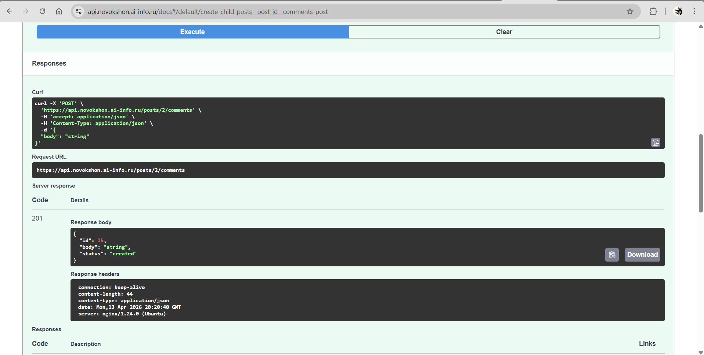

---

# Часть B. JavaScript-клиенты

## Задание 8. Vanilla JS — демо

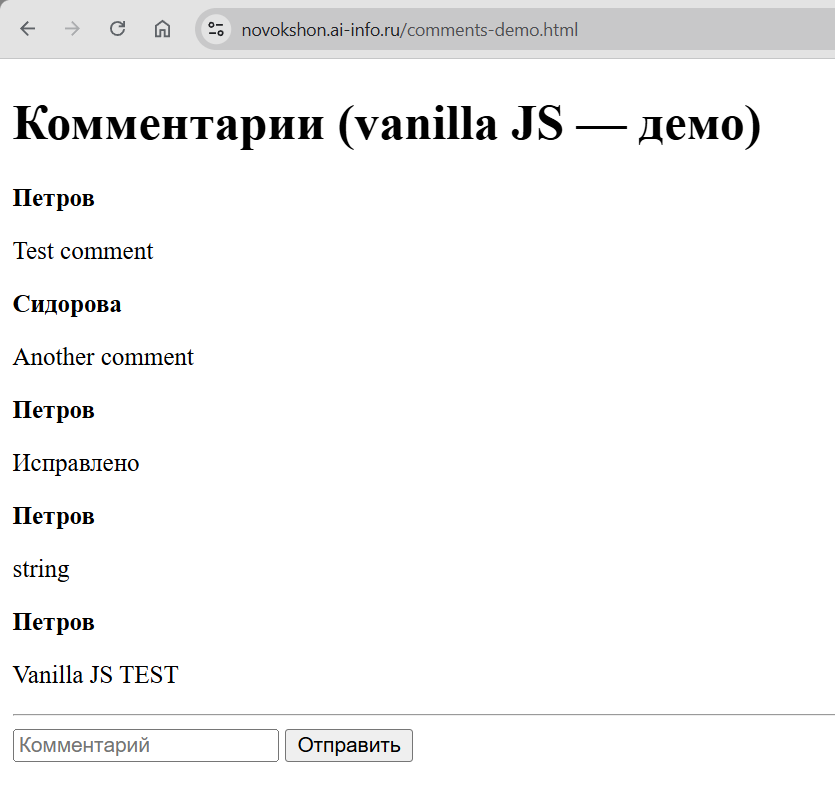

**Что делает функция `esc()`? Что случится если её не вызвать?**

`esc()` экранирует HTML-спецсимволы в пользовательских данных перед вставкой через `innerHTML`. Она создаёт временный DOM-элемент, присваивает строку через `textContent` (который не интерпретирует HTML), и считывает результат через `innerHTML` — на выходе символы `<`, `>`, `&`, `"` заменяются на безопасные HTML-сущности.

Если не вызвать `esc()` и вставить данные напрямую через `innerHTML`, браузер будет интерпретировать содержимое как HTML. Злоумышленник может написать комментарий ``, который выполнит JavaScript в браузерах других пользователей — это классическая XSS-атака (межсайтовый скриптинг).

## Задание 9. React — полный CRUD

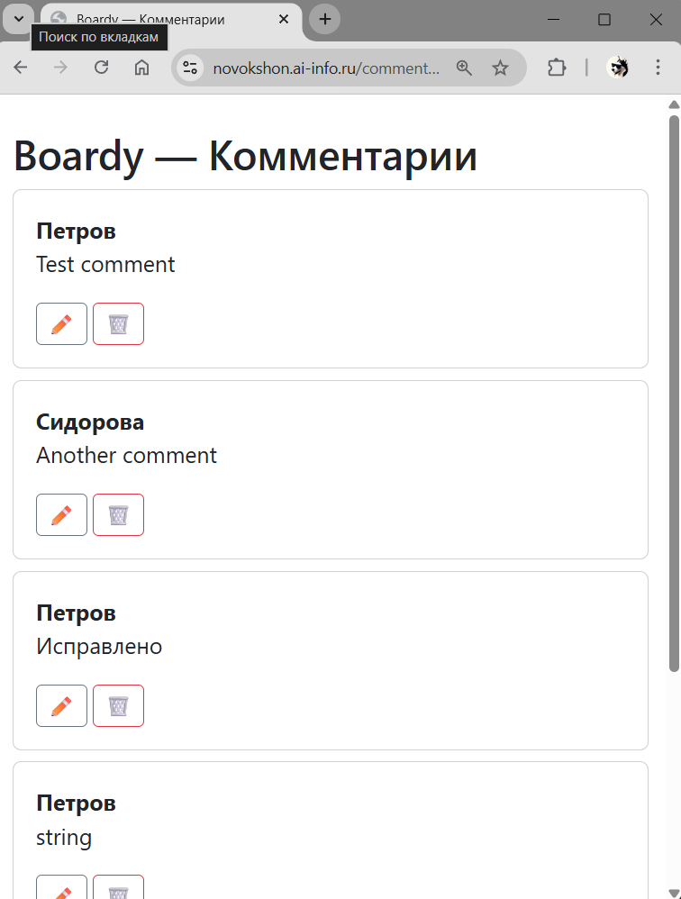

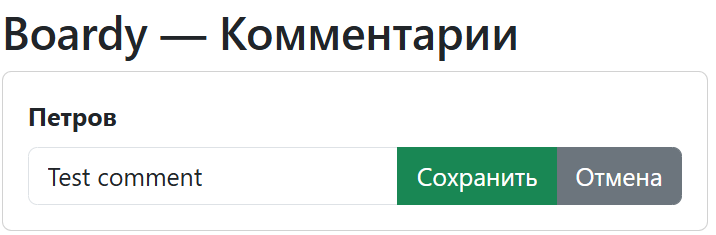

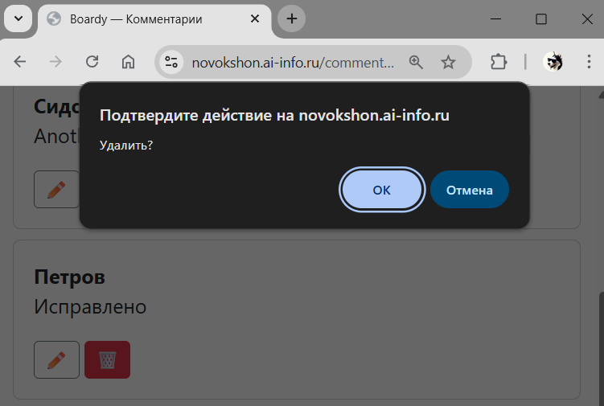

## Задание 10. Сравнение кода

**Где хранится состояние?**
В vanilla JS состояние нигде не хранится — список живёт только в DOM (в `innerHTML`), текст формы — в значении `<input>`. После каждого действия весь список перезапрашивается и перерисовывается заново. В React состояние хранится в переменных `useState` (`items`, `text`, `editId`, `editText`) — React знает текущее состояние и перерисовывает только то, что изменилось.

**Как обновляется список после добавления?**
В обоих случаях вызывается `load()` / функция загрузки после успешного POST. Разница в том, что в vanilla JS `innerHTML` переписывается целиком, а React через `setItems()` точечно обновляет только изменившиеся карточки.

**Как реализовано редактирование?**
В vanilla JS редактирование потребовало бы ручной замены DOM-элементов — удалить параграф с текстом, создать `<input>`, добавить кнопки. В React достаточно одной переменной `editId`: условие `{editId === item.id ? <форма> : <текст>}` в JSX, и React сам перерисовывает нужный элемент.

**Как защищаемся от XSS?**
Vanilla JS требует ручного вызова `esc()` для каждой строки из пользовательских данных — человеческий фактор: забыл вызвать — дыра. React экранирует любое значение в `{фигурных скобках}` автоматически — XSS-защита работает по умолчанию без дополнительных усилий.

## Задание 11. DevTools → Network

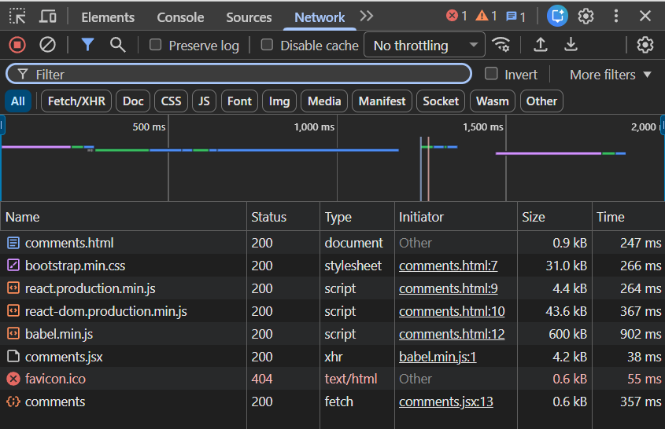

**Сколько запросов? Какой из них — к API?**

При загрузке `comments.html` браузер делает **8 запросов**:
1. `comments.html` — сам HTML-документ
2. `bootstrap.min.css` — стили Bootstrap
3. `react.production.min.js` — библиотека React
4. `react-dom.production.min.js` — React DOM
5. `babel.min.js` — транслятор JSX
6. `comments.jsx` — наш компонент
7. `favicon.ico` — иконка (404, не критично)
8. `comments` — **это запрос к API** (`/api/posts/.../comments`), тип fetch, инициирован из `comments.jsx`

К API относится последний запрос типа `fetch` — именно он получает данные из FastAPI и передаёт их в React для отрисовки.

---

# Часть C. SSR vs CSR

## Задание 12. View Source

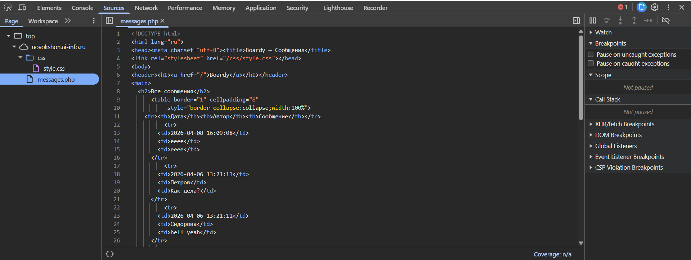

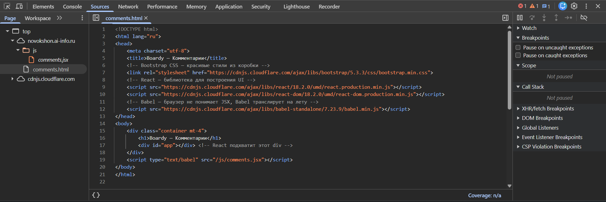

**Почему в CSR нет данных в исходнике? Что увидит поисковый бот?**

В SSR (messages.php) PHP выполняет SQL-запрос на сервере и вставляет данные прямо в HTML до отправки клиенту. Браузер получает готовую страницу с данными — View Source показывает их полностью.

В CSR (comments.html) сервер отдаёт пустой HTML с `<div id="app"></div>`. Данные появляются только после того, как браузер скачает JavaScript, выполнит его, и React сделает fetch-запрос к API. View Source показывает исходный файл с диска — без данных.

Поисковый бот, как правило, не выполняет JavaScript. Для `messages.php` он увидит все посты и сможет их проиндексировать. Для `comments.html` он увидит только пустой `<div>` — комментарии не попадут в поисковый индекс.

## Задание 13. XSS

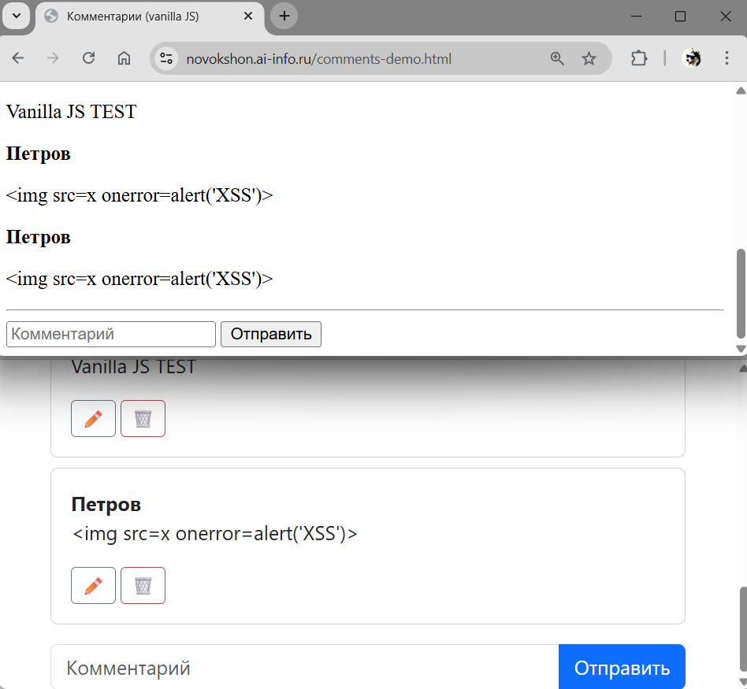

**Как vanilla JS и React защищаются от XSS? Какой способ надёжнее?**

Vanilla JS защищается через функцию `esc()`: она использует `textContent` для экранирования спецсимволов перед вставкой через `innerHTML`. Это работает, но требует дисциплины — разработчик обязан помнить вызывать `esc()` для каждой пользовательской строки. Один пропуск — и уязвимость.

React экранирует все выражения в JSX автоматически. Любое значение в `{item.body}` трактуется как текст, а не как HTML — браузер никогда не выполнит его как код. Единственный способ обойти защиту React — явно использовать `dangerouslySetInnerHTML`, что уже само по себе предупреждение в названии.

React надёжнее: защита работает по умолчанию, человеческий фактор исключён.

## Задание 14. Итоговая таблица

|  | SSR (PHP) | Vanilla JS | React |
|--|-----------|------------|-------|
| Кто рендерит HTML | Сервер (PHP) | Браузер (JS) | Браузер (React) |
| Формат ответа сервера | Готовый HTML | JSON | JSON |
| View Source: данные видны? | Да | Нет | Нет |
| Перезагрузка при отправке | Да (редирект) | Нет | Нет |
| Защита от XSS | Вручную (htmlspecialchars) | Вручную (esc()) | Автоматически |
| Сложность кода | Низкая | Средняя | Выше, но масштабируется |
